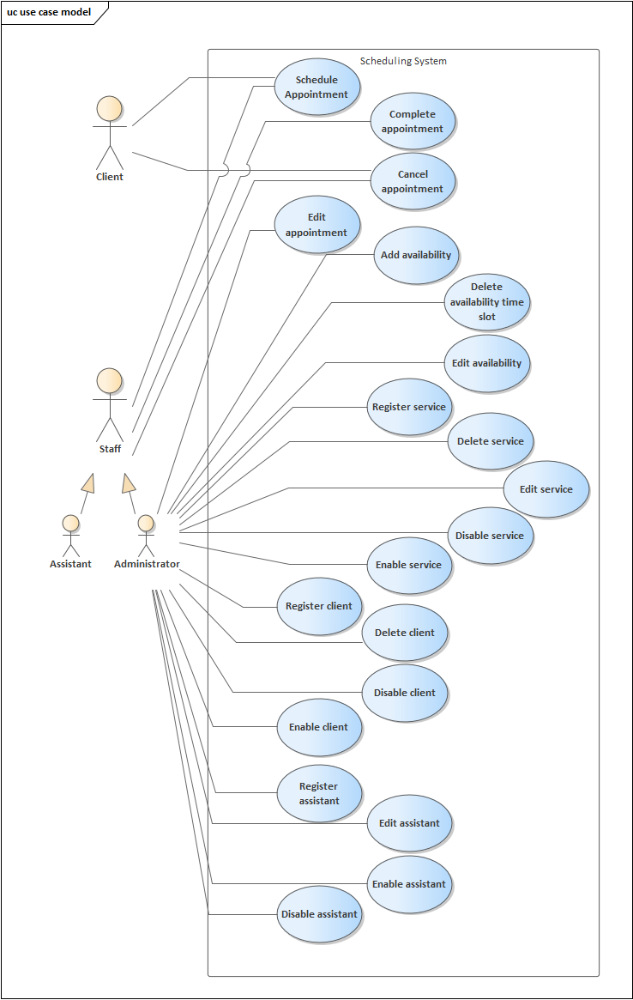
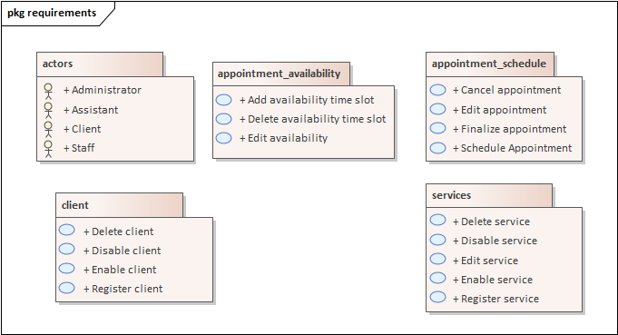

# Project Overview
## System Name:
- `Appointment Scheduling System`
## System Description:
- `The Appointment Scheduling System aims to facilitate the management of client appointments for business X. This system should allow clients to schedule their own appointments or provide business owners the ability to schedule appointments on behalf of their clients.`
* `Ideal for managing appointment times, such as for medical offices, salons or consultations`
## System Objectives:
- `Allow clients of business X to schedule their own appointments to physically attend the business.`
- `Allow the staff of business X to schedule appointments for their clients so that they can physically attend the business.`

## System Features:

### Client Module:
1. `Register client`
2. `Delete client`
3. `Disable client`
4. `Enable client`
### Schedule Module:
1. `Schedule appointment`
2. `Edit appointment`
3. `Cancel appointment`
4. `Finalize appointment`
### Availability Module:
1. `Add availability time slot`
2. `Edit availability time slot`
3. `Delete availability time slot`
### Service Module:
1. `Register service`
2. `Edit service`
3. `Disable service`
4. `Enable service`
5. `Delete service` `

## Proposed Methodology or Methods:
- `Attribute-Driven Development`
### Methodology Activities:
- `Pending`

# Process

## Requirements

### Prototypes

### Use Cases

### Use Case Descriptions

#### Agenda Module

| Use Case             | Description                                                                                                                                                                                                                                                                                                                                                                                                                                                                                                                                                                                                                                                                                                                                                                                                                                                                                                                                                                                                                                             |
| -------------------- | ------------------------------------------------------------------------------------------------------------------------------------------------------------------------------------------------------------------------------------------------------------------------------------------------------------------------------------------------------------------------------------------------------------------------------------------------------------------------------------------------------------------------------------------------------------------------------------------------------------------------------------------------------------------------------------------------------------------------------------------------------------------------------------------------------------------------------------------------------------------------------------------------------------------------------------------------------------------------------------------------------------------------------------------------------- |
| Schedule Appointment | - The Agenda Manager clicks the button or clicks on the agenda at a specific time   - The system displays the "Schedule Appointment" window with a START TIME assigned if the agenda was clicked, and retrieves the SERVICES registered in the database   - The Agenda Manager selects the required services   - The system validates the information, and if valid, registers the APPOINTMENT in the database, shows a success message, and sends a notification to the ADMINISTRATOR   - The administrator receives the notification and clicks the "View Appointment Details" button   - The system displays the "Confirm Appointment" window with the appointment details   - The administrator either modifies or leaves the details unchanged and clicks the "Confirm Appointment" button   - The system validates the data, and if valid, changes the appointment status from PENDING to CONFIRMED and notifies the CLIENT of the confirmation, also sending the confirmation via email or SMS to the CLIENT's phone number |
| Edit Appointment     | - The Agenda Manager clicks on a specific time slot in the "Schedule Appointment" window   - The system displays the details of the time slot in a modal window   - The Agenda Manager (Administrative Personnel) clicks the "View Details" button   - The system displays the "Edit Appointment" window   - The Administrative Personnel enters the new data and clicks the "Accept" button   - The system validates the information, and if valid, updates the data in the database and shows a success message.                                                                                                                                                                                                                                                                                                                                                                                                                                                                                                                       |
| Cancel Appointment   | - The ADMINISTRATOR selects an appointment in the "Appointments" window   - The system shows the details of the appointment in a modal window   - The ADMINISTRATOR clicks the "View Details" button   - The system displays the "Edit Appointment" window   - The ADMINISTRATOR clicks the "Cancel Appointment" button   - The system shows a confirmation window and requests the ADMINISTRATOR's password   - The administrator enters the ADMINISTRATOR's password and clicks the "Confirm" button   - The system verifies the information, and if valid, deletes the appointment from the database and shows a success message                                                                                                                                                                                                                                                                                                                                                                                                |
| Finalize Appointment | - The Administrative Personnel selects an appointment in the "Appointments" window   - The system shows the details in a modal window   - The Administrative Personnel clicks the "View Details" button   - The system displays the "Edit Appointment" window   - The Administrative Personnel clicks the "Finalize Appointment" button                                                                                                                                                                                                                                                                                                                                                                                                                                                                                                                                                                                                                                                                                                     |
#### Availability Module

| Use Case                      | Description                                                                                                                                                                                                                                                                                                                                                                                                                                                                                                       |
| ----------------------------- | ----------------------------------------------------------------------------------------------------------------------------------------------------------------------------------------------------------------------------------------------------------------------------------------------------------------------------------------------------------------------------------------------------------------------------------------------------------------------------------------------------------------- |
| Assign Availability time slot | - The administrator clicks the "Assign Availability" button in the "Availability" window   - The system displays the "Assign Availability" window   - The administrator enters the information for the available time slot and clicks the "Schedule" button   - The system validates the information, and if valid, displays a success message                                                                                                                                                           |
| Delete Availability Slot      | - The administrator selects a time slot in the "Availability" window  - The system shows a modal window with the details of the assigned time slot   - The administrator clicks the "Delete" button   - The system shows a confirmation window and requests the ADMINISTRATOR's password   - The administrator enters the ADMINISTRATOR's password and clicks the "Confirm" button   - The system deletes the ASSIGNED TIME SLOT from the ASSISTANT in the database and displays a success message |
| Edit Availability             | - The administrator selects a time slot in the "Availability" window  - The system shows a modal window with the details of the assigned time slot   - The administrator clicks the "Edit" button   - The system displays the "Edit Assistant Availability" window   - The administrator provides the new availability information and clicks the "Accept" button   - The system validates the information, and if valid, displays a success message                                               |

#### Assistant Module

|Use Case|Description|
|---|---|
|Register Assistant|- The system administrator clicks the "Register" button in the "Assistants" window   - The system displays the "Register Assistant" window   - The administrator provides the assistant's data and selects the assistant's services, then clicks the "Add" button   - The system displays the "Add Services" window   - The administrator selects the services and clicks the "Accept" button   - The system adds the selected services to the "Assigned Services to Assistant" table   - The administrator clicks the "Register" button   - The system verifies the data and proceeds to register the new assistant in the database and displays a success message|
|Edit Assistant|- The system administrator clicks the "View Details" button in the "Assistants" table in the "Assistants" window   - The system displays the "Edit Assistant" window   - The administrator provides the new assistant's data and selects the assistant's services, then clicks the "Add" button   - The system displays the "Add Services" window   - The administrator selects the services and clicks the "Accept" button   - The system adds the selected services to the "Assigned Services to Assistant" table   - The administrator clicks the "Register" button   - The system verifies the data and proceeds to modify the assistant's data in the database and displays a success message|
|Disable Assistant|- The system administrator clicks the "View Details" button in the "Assistants" table in the "Assistants" window   - The system displays the "Edit Assistant" window   - The administrator clicks the "Disable" button   - The system checks if the assistant's status is ENABLED and, if valid, changes the assistant's status to DISABLED and displays a success message; if not, an error message is displayed|
|Enable Assistant|- The system administrator clicks the "View Details" button in the "Assistants" table in the "Assistants" window   - The system displays the "Edit Assistant" window   - The administrator clicks the "Enable" button   - The system checks if the assistant's status is DISABLED and, if valid, changes the assistant's status to ENABLED and displays a success message; if not, an error message is displayed|

#### Services Module

| Use Case         | Description                                                                                                                                                                                                                                                                                                                                                                                                                                                                                  |
| ---------------- | -------------------------------------------------------------------------------------------------------------------------------------------------------------------------------------------------------------------------------------------------------------------------------------------------------------------------------------------------------------------------------------------------------------------------------------------------------------------------------------------- |
| Register Service | - The system administrator clicks the "Register" button in the "Services" window   - The system displays the "Register Service" window   - The administrator provides the new service information and clicks the "Accept" button   - The system checks that the information is not duplicated, and if valid, adds the new service to the database and displays a success message                                                                                                    |
| Disable Service  | - The system administrator clicks the "View Details" button for a service in the "Services" table   - The system displays the "Edit Service" window   - The administrator clicks the "Disable" button   - The system checks that the service is in the ENABLED state and, if valid, changes the status to DISABLED in the database and displays a success message                                                                                                                   |
| Enable Service   | - The system administrator clicks the "View Details" button for a service in the "Services" table   - The system displays the "Edit Service" window   - The administrator clicks the "Enable" button   - The system checks that the service is in the DISABLED state and, if valid, changes the status to ENABLED in the database and displays a success message                                                                                                                    |
| Delete Service   | - The system administrator clicks the "View Details" button for a service in the "Services" table   - The system displays the "Edit Service" window   - The administrator clicks the "Delete" button   - The system displays a confirmation window and requests the ADMINISTRATOR's password   - The administrator provides the ADMINISTRATOR's password and clicks the "Confirm" button   - The system deletes the service from the database and displays a success message. |
| Edit Service     | - The system administrator clicks the "View Details" button for a service in the "Services" table   - The system displays the "Edit Service" window   - The administrator provides the new service information and clicks the "Accept" button   - The system verifies the data and proceeds to modify the information in the database and displays a success message.                                                                                                               |
#### Client Module

| Use Case        | Description                                                                                                                                                                                                                                                                                                                                                                                                                                               |
| --------------- | --------------------------------------------------------------------------------------------------------------------------------------------------------------------------------------------------------------------------------------------------------------------------------------------------------------------------------------------------------------------------------------------------------------------------------------------------------- |
| Register Client | - The system administrator provides the required information for the clients in a registration window.   - The system checks that the client information to be registered is not duplicated, and if valid, adds the information to the database and updates the client table. If not, it displays a message about duplicate information                                                                                                                |
| Disable Client  | - The system administrator selects a client from the client table and clicks the "Disable" button   - The system displays the "Edit Client" window   - The administrator clicks the "Disable Client" button   - The system checks that the client is not currently disabled in the database and, if valid, changes the client's status to DISABLED and displays a success message. If not, it displays an error message.                         |
| Enable Client   | - The system administrator selects a client from the client table and clicks the "View Details" button   - The system displays the "Edit Client" window   - The administrator clicks the "Enable Client" button   - The system checks that the client is not currently enabled in the database and, if valid, changes the client's status to ENABLED and displays a success message. If not, it displays an error message.                       |
| Delete Client   | - The system administrator clicks the "View Details" button for a client   - The system displays the "Edit Client" window   - The administrator clicks the "Delete" button   - The system displays a confirmation window and requests the ADMINISTRATOR's password   - The administrator provides the password and clicks the "Delete" button   - The system deletes the selected client from the database and displays a success message. |

### Quality Attributes

Requirements:

1. The system should not allow login into multiple accounts at the same time
2. The system should allow selecting a time range and block that slot for at least 2 minutes before the appointment is canceled. The selected time range should have a maximum duration of 3 hours.
3. The system should only allow scheduling a maximum of one appointment per user.
4. The system must support at least 20,000 users concurrently querying the prices of services.
6. The system must validate user credentials against an Identity User Service, and once logged in, the user can only access the actions they are authorized to perform.
7. The system must be capable of adding new features within a maximum of 2 months.
8. The system must support the integration testing independently of external systems.
9. The system must be operational and accessible during working hours, including weekends.
10. The system must support data encryption (especially for passwords and bank account information) to protect against unauthorized access.
11. The system must allow integration with external systems, such as messaging and email services.
12. The system must notify the administrator, client or assistant within 10-15 seconds when an appointment is created, finalized or canceled.
13. The system must send automated reminders (via email or SMS) to users (clients, assistants or administrators) about upcoming appointments at predefined intervals (30 minutes before the appointment).
14. The system should keep a record of all past appointments and their statuses (completed or canceled) and allow users to view their appointment history.
15. The system should allow clients to cancel appointments before the appointment is started
16. The system should support multiple languages for a diverse user base, depending on the geographic region.
17. The system should automatically detect scheduling conflicts and prevent them (like race condition).

| ID  | Quality Attribute | Scenario | Associated Use Case |
| --- | ----------------- | -------- | ------------------- |
|     |                   |          |                     |

