# Project Overview
## System Name:
- `Appointment Scheduling System`
## System Description:
- `The Appointment Scheduling System aims to facilitate the management of client appointments for business X. This system should allow clients to schedule their own appointments or provide business owners the ability to schedule appointments on behalf of their clients.`
* `Ideal for managing appointment times, such as for medical offices, salons or consultations`
## System Objectives:
- `Allow clients of business X to schedule their own appointments to physically attend the business.`
- `Allow the staff of business X to schedule appointments for their clients so that they can physically attend the business.`

## System Features:

### Client Module:
1. `CE-1 Register client`
2. `CE-2 Delete client`
4. `CE-3 Enable client`
5. `CE-4 Disable client`
### Appointment Schedule Module:
1. `CA-1 Schedule appointment (Client-self)`
2. `CA-2 Edit appointment`
3. `CA-3 Cancel appointment (Staff-assisted)`
4. `CA-4 Finalize appointment`
5. `CA-5 Schedule appointment (Staff-assisted)`
6. `CA-6 Confirm appointment`
7. `CA-7 Cancel appointment (Client-self)`
### Appointment Availability Module:
1. `CB-1 Add availability time slot`
2. `CB-2 Delete availability time slot`
3. `CB-3 Edit availability time slot`
### Service Module:
1. `CD-1 Register service`
2. `CD-2 Disable service`
4. `CD-3 Enable service`
5. `CD-4 Delete service`
3. `CD-5 Edit service`
### Assistant Module:
1. `CC-1 Register assistant`
2. `CC-2 Edit assistant`
3. `CC-3 Disable assistant`
4. `CC-4 Enable assistant`

## Proposed Methodology or Methods:
- `Attribute-Driven Design`
### Methodology Activities:
- `Pending`

# Software Process

## Requirements

### Use Case Model

### State machine

#### Appointment states

#### Client states

#### Services states

#### Assistant states

### Use Case Descriptions

#### Agenda Module

| Use-case field       | Description                                                                                                                                                                                                                                                                                                                                                                                                                                                                                                                                                                                                                                                                                                                                                                                                                                                                                                                                                                                                                                                                                                                                                                                                                                                                                                                                                                                                                                                                                                                                                                                                                                                                                                                                                                                                                                                                                                                                                                                                                                                                                                                                                                                                                                                                                                                                                 |
| -------------------- | ----------------------------------------------------------------------------------------------------------------------------------------------------------------------------------------------------------------------------------------------------------------------------------------------------------------------------------------------------------------------------------------------------------------------------------------------------------------------------------------------------------------------------------------------------------------------------------------------------------------------------------------------------------------------------------------------------------------------------------------------------------------------------------------------------------------------------------------------------------------------------------------------------------------------------------------------------------------------------------------------------------------------------------------------------------------------------------------------------------------------------------------------------------------------------------------------------------------------------------------------------------------------------------------------------------------------------------------------------------------------------------------------------------------------------------------------------------------------------------------------------------------------------------------------------------------------------------------------------------------------------------------------------------------------------------------------------------------------------------------------------------------------------------------------------------------------------------------------------------------------------------------------------------------------------------------------------------------------------------------------------------------------------------------------------------------------------------------------------------------------------------------------------------------------------------------------------------------------------------------------------------------------------------------------------------------------------------------------------------- |
| Use case name        | CA-01 Schedule Appointment (Client-Self)                                                                                                                                                                                                                                                                                                                                                                                                                                                                                                                                                                                                                                                                                                                                                                                                                                                                                                                                                                                                                                                                                                                                                                                                                                                                                                                                                                                                                                                                                                                                                                                                                                                                                                                                                                                                                                                                                                                                                                                                                                                                                                                                                                                                                                                                                                                    |
| Actors               | Client, Staff                                                                                                                                                                                                                                                                                                                                                                                                                                                                                                                                                                                                                                                                                                                                                                                                                                                                                                                                                                                                                                                                                                                                                                                                                                                                                                                                                                                                                                                                                                                                                                                                                                                                                                                                                                                                                                                                                                                                                                                                                                                                                                                                                                                                                                                                                                                                               |
| Use case overview    | A client schedules an appointment for a service with an assistant. The system checks availability, assigns the appropriate assistant, and confirms the appointment                                                                                                                                                                                                                                                                                                                                                                                                                                                                                                                                                                                                                                                                                                                                                                                                                                                                                                                                                                                                                                                                                                                                                                                                                                                                                                                                                                                                                                                                                                                                                                                                                                                                                                                                                                                                                                                                                                                                                                                                                                                                                                                                                                                          |
| Preconditions        | PRE-01: An AVAILABILITY TIME SLOT must be registered. PRE-02: An ASSISTANT must be registered. PRE-03: A SERVICE must be registered and assigned to an ASSISTANT                                                                                                                                                                                                                                                                                                                                                                                                                                                                                                                                                                                                                                                                                                                                                                                                                                                                                                                                                                                                                                                                                                                                                                                                                                                                                                                                                                                                                                                                                                                                                                                                                                                                                                                                                                                                                                                                                                                                                                                                                                                                                                                                                                                      |
| Postcondition        | POST-01: An APPOINTMENT is successfully scheduled with status "CONFIRMED" POST-02: Notifications have been created and sent to Client.                                                                                                                                                                                                                                                                                                                                                                                                                                                                                                                                                                                                                                                                                                                                                                                                                                                                                                                                                                                                                                                                                                                                                                                                                                                                                                                                                                                                                                                                                                                                                                                                                                                                                                                                                                                                                                                                                                                                                                                                                                                                                                                                                                                                                   |
| Trigger              | The Client selects SERVICES and startTime and click the button "Agendar cita" in the "Agendar Cita" window                                                                                                                                                                                                                                                                                                                                                                                                                                                                                                                                                                                                                                                                                                                                                                                                                                                                                                                                                                                                                                                                                                                                                                                                                                                                                                                                                                                                                                                                                                                                                                                                                                                                                                                                                                                                                                                                                                                                                                                                                                                                                                                                                                                                                                                  |
| Use case description | NF-1: The System checks if the AVAILABILITY TIME SLOT is available (AF-1), blocks the AVAILABILITY TIME SLOT for 2 minutes (AF-2), gets the all SERVICES available for that AVAILABILITY TIME SLOT and displays the "Agendar cita" window (EX-1, EX-2). NF-2: The Client presses the button "Agendar" (AF-4, AF-5). NF-3: The System checks if data provided are valid (AF-3) and checks if CLIENT, SERVICES and ASSISTANT are available (AF-6, AF-7, AF-9), stores a APPOINTMENT in the database with status SCHEDULED, unblocks the AVAILABILITY TIME SLOT and displays a successful message. The System notifies the Staff of a new APPOINTMENT created. NF-4: The use case "CA-6 Confirm appointment" starts. NF-5: The system notifies the Client that the APPOINTMENT has been successfully confirmed and change status to CONFIRMED (FA-8). NF-6: The use case ends here.                                                                                                                                                                                                                                                                                                                                                                                                                                                                                                                                                                                                                                                                                                                                                                                                                                                                                                                                                                                                                                                                                                                                                                                                                                                                                                                                                                                                                                                             |
| Alternative Flows    | **AF-1: Another Client or Staff has scheduled an appointment in the AVAILABILITY TIME SLOT:** AF-1.1: The System notifies the user that the time slot is no longer available and prompts them to choose a different slot. AF-1.2: The use case ends here. **AF-2 Another Client or Staff is scheduling an appointment during the AVAILABILITY TIME SLOT** AF-2.1:  The System notifies the user that the time slot is no longer available and prompts them to choose a different slot. AF-2.2: The use case ends here. **AF-3: The Client has provided invalid data:** AF-3.1: The System notifies the Client has provided invalid data and prompts them to send valid data. AF-3.2: The use case flow returns to NF-2 **AF-4: The Client presses the button "Cancel":** AF-4.1: The System prompts the user if he wants to perform that action. AF-4.2: The Client presses the button "Accept" AF-4.3: The System unblocks the AVAILABILITY TIME SLOT and closes the "Agendar Cita" window. AF-4.4: The use use case ends here. **AF-5: The Client selects another services for the AVAILABILITY TIME SLOT:** AF-5.1: The System validates that the hours of the SERVICES are not greater than the total hours for the AVAILABILITY TIME SLOT selected (AF-3) and modifies the summary of the appointment. AF-5.2: The use case flow returns to NF-2 **AF-6: The SERVICE has been disabled or deleted.** AF-6.1: The System notifies the Client that the SERVICE has been disabled or deleted and removes SERVICE from selected SERVICES in the "Agendar Cita" window. AF-6.2: The use case flow returns to NF-2 **AF-7: The ASSISTANT has been disabled or deleted.** AF-7.1: The System notifies the Client that the ASSISTANT has been disabled or deleted and removes any SERVICE assigned to the ASSISTANT from the selected SERVICES in the "Agendar cita" window. AF-7.2: The use case flow returns to NF-2 **AF-8: The APPOINTMENT has been cancelled:** AF-8.1: The system notifies the Client that the APPOINTMENT has been cancelled and changes status to CANCELLED (FA-8). AF-8.2 The use case ends. **AF-9: The Client has been disabled or deleted:** AF-9.1 The system notifies that Client has been disabled or deleted AF-9.2 The use case case ends |
| Exception            | **EX-1: No internet connection** EX-1.1: The System displays an error message prompting the user to check their network connection and try again. EX-1.2: The use case ends here. **EX-2: Error to execute operation** EX-2.1: The System encounters an internal error (e.g., database failure, server timeout) and notifies the user of the issue, offering to retry the operation. EX-2.2: The use case ends here.                                                                                                                                                                                                                                                                                                                                                                                                                                                                                                                                                                                                                                                                                                                                                                                                                                                                                                                                                                                                                                                                                                                                                                                                                                                                                                                                                                                                                                                                                                                                                                                                                                                                                                                                                                                                                                                                                                                         |

| Use-case field       | Description                                                                                                                                                                                                                                                                                                                                                                                                                                                                                                                                                                                                                                                                                                                                                                                                                                                                                                                                                                                                                                                                                                                                                                                                                                                                                                                                                                                                                                                                                                                                                                                                                                                                                                                                                                                                                                                                                                                                                                                                                                                                                                                                                                                                                                                                                                                                                        |
| -------------------- | ------------------------------------------------------------------------------------------------------------------------------------------------------------------------------------------------------------------------------------------------------------------------------------------------------------------------------------------------------------------------------------------------------------------------------------------------------------------------------------------------------------------------------------------------------------------------------------------------------------------------------------------------------------------------------------------------------------------------------------------------------------------------------------------------------------------------------------------------------------------------------------------------------------------------------------------------------------------------------------------------------------------------------------------------------------------------------------------------------------------------------------------------------------------------------------------------------------------------------------------------------------------------------------------------------------------------------------------------------------------------------------------------------------------------------------------------------------------------------------------------------------------------------------------------------------------------------------------------------------------------------------------------------------------------------------------------------------------------------------------------------------------------------------------------------------------------------------------------------------------------------------------------------------------------------------------------------------------------------------------------------------------------------------------------------------------------------------------------------------------------------------------------------------------------------------------------------------------------------------------------------------------------------------------------------------------------------------------------------------------ |
| Use case name        | CA-05 Schedule Appointment (Staff-asisted)                                                                                                                                                                                                                                                                                                                                                                                                                                                                                                                                                                                                                                                                                                                                                                                                                                                                                                                                                                                                                                                                                                                                                                                                                                                                                                                                                                                                                                                                                                                                                                                                                                                                                                                                                                                                                                                                                                                                                                                                                                                                                                                                                                                                                                                                                                                         |
| Actors               | Staff                                                                                                                                                                                                                                                                                                                                                                                                                                                                                                                                                                                                                                                                                                                                                                                                                                                                                                                                                                                                                                                                                                                                                                                                                                                                                                                                                                                                                                                                                                                                                                                                                                                                                                                                                                                                                                                                                                                                                                                                                                                                                                                                                                                                                                                                                                                                                              |
| Use case overview    | A staff schedules an appointment to a client for a service with an assistant. The system checks availability, checks client appointments, assigns the appropriate assistant, and confirms the appointment                                                                                                                                                                                                                                                                                                                                                                                                                                                                                                                                                                                                                                                                                                                                                                                                                                                                                                                                                                                                                                                                                                                                                                                                                                                                                                                                                                                                                                                                                                                                                                                                                                                                                                                                                                                                                                                                                                                                                                                                                                                                                                                                                          |
| Preconditions        | PRE-01: An AVAILABILITY TIME SLOT must be registered. PRE-02: An ASSISTANT must be registered. PRE-03: A SERVICE must be registered and assigned to an ASSISTANT PRE-04: A Client must be registered and must not have any existing scheduled appointment.                                                                                                                                                                                                                                                                                                                                                                                                                                                                                                                                                                                                                                                                                                                                                                                                                                                                                                                                                                                                                                                                                                                                                                                                                                                                                                                                                                                                                                                                                                                                                                                                                                                                                                                                                                                                                                                                                                                                                                                                                                                                                                |
| Postcondition        | POST-01: An APPOINTMENT is successfully scheduled with status "CONFIRMED" POST-02: Notifications have been created and sent to Client.                                                                                                                                                                                                                                                                                                                                                                                                                                                                                                                                                                                                                                                                                                                                                                                                                                                                                                                                                                                                                                                                                                                                                                                                                                                                                                                                                                                                                                                                                                                                                                                                                                                                                                                                                                                                                                                                                                                                                                                                                                                                                                                                                                                                                          |
| Trigger              | The Staff select SERVICES and startTime and click the button "Agendar cita" in the "Agendar Cita" window                                                                                                                                                                                                                                                                                                                                                                                                                                                                                                                                                                                                                                                                                                                                                                                                                                                                                                                                                                                                                                                                                                                                                                                                                                                                                                                                                                                                                                                                                                                                                                                                                                                                                                                                                                                                                                                                                                                                                                                                                                                                                                                                                                                                                                                           |
| Use case description | NF-1: The System checks if the AVAILABILITY TIME SLOT is available (AF-1), checks if another Client or Staff is scheduling an appointment during the AVAILABILITY TIME SLOT (AF-2), gets the SERVICES available for that AVAILABILITY TIME SLOT (EX-1), displays the "Agendar cita" window and blocks the AVAILABILITY TIME SLOT for 2 minutes (EX-1, EX-2). NF-2: The Staff selects a CLIENT and presses the button "Agendar" (AF-4, AF-5). NF-3: The System checks if data provided are valid (AF-3) and checks if SERVICES, CLIENT and ASSISTANT are available (AF-6, AF-7, AF-8, AF-9), stores a APPOINTMENT in the database with status CONFIRMED, unblocks the AVAILABILITY TIME SLOT and displays a successful message. The System notifies the selected Assistant and the Client of a new APPOINTMENT created. NF-4: The use case ends here.                                                                                                                                                                                                                                                                                                                                                                                                                                                                                                                                                                                                                                                                                                                                                                                                                                                                                                                                                                                                                                                                                                                                                                                                                                                                                                                                                                                                                                                                                                      |
| Alternative Flows    | **AF-1: Another Client or Staff has scheduled an appointment in the AVAILABILITY TIME SLOT:** AF-1.1: The System notifies the user that the time slot is no longer available and prompts them to choose a different slot. AF-1.2: The use case ends here. **AF-2 Another Client or Staff  is scheduling an appointment during the AVAILABILITY TIME SLOT** AF-2.1:  The System notifies the user that the time slot is no longer available and prompts them to choose a different slot. AF-2.2: The use case ends here. **AF-3: The Staff has provided invalid data:** AF-3.1: The System notifies the Staff has provided invalid data and prompts them to send valid data. AF-3.2: The use case flow returns to NF-2 **AF-4: The Staff presses the button "Cancel":** AF-4.1: The System prompts the user if he wants to perform that action. AF-4.2: The Staff presses the button "Accept" AF-4.3: The System unblocks the AVAILABILITY TIME SLOT and closes the "Agendar Cita" window. AF-4.4: The use use case ends here. **AF-5: The Staff selects another services for the AVAILABILITY TIME SLOT:** AF-5.1: The System validates that the hours of the SERVICES are not greater than the total hours for the AVAILABILITY TIME SLOT selected (AF-3) and modifies the summary of the appointment. AF-5.2: The use case flow returns to NF-2 **AF-6: The SERVICE has been disabled or deleted.** AF-6.1: The System notifies the Staff that the SERVICE has been disabled or deleted and removes SERVICE from selected SERVICES in the "Agendar Cita" window. AF-6.2: The use case flow returns to NF-2 **AF-7: The ASSISTANT has been disabled or deleted.** AF-7.1: The System notifies the Staff that the ASSISTANT has been disabled or deleted and removes  any SERVICE assigned to the ASSISTANT from the selected SERVICES in the "Agendar cita" window. AF-7.2: The use case flow returns to NF-2 **AF-8: The Client has scheduled another APPOINTMENT:** AF-8.1 The system notifies the Staff that Client has scheduled another APPOINTMENT: AF-8.2 The use case flow returns to NF-2 **AF-9: The Client has been disabled or deleted:** AF-9.1 The system notifies the Staff that Client has been disabled or deleted: AF-9.2 The use case flow returns to NF-2 |
| Exception            | **EX-1: No internet connection** EX-1.1: The System displays an error message prompting the user to check their network connection and try again. EX-1.2: The use case ends here. **EX-2: Error to execute operation** EX-2.1: The System encounters an internal error (e.g., database failure, server timeout) and notifies the user of the issue, offering to retry the operation. EX-2.2: The use case ends here.                                                                                                                                                                                                                                                                                                                                                                                                                                                                                                                                                                                                                                                                                                                                                                                                                                                                                                                                                                                                                                                                                                                                                                                                                                                                                                                                                                                                                                                                                                                                                                                                                                                                                                                                                                                                                                                                                                                                |

| Use-case field       | Description                                                                                                                                                                                                                                                                                                                                                                                                                                                                                                                                                                                                                                                                                                                |
| -------------------- | -------------------------------------------------------------------------------------------------------------------------------------------------------------------------------------------------------------------------------------------------------------------------------------------------------------------------------------------------------------------------------------------------------------------------------------------------------------------------------------------------------------------------------------------------------------------------------------------------------------------------------------------------------------------------------------------------------------------------- |
| Use case name        | CA-06 Confirm Appointment                                                                                                                                                                                                                                                                                                                                                                                                                                                                                                                                                                                                                                                                                                  |
| Actors               | Staff                                                                                                                                                                                                                                                                                                                                                                                                                                                                                                                                                                                                                                                                                                                      |
| Use case overview    | A staff member confirms a new appointment that has been created and is currently in the TO_BE_CONFIRMED status. This action ensures that the appointment is finalized and is assigned a status of CONFIRMED.                                                                                                                                                                                                                                                                                                                                                                                                                                                                                                               |
| Preconditions        | PRE-01: An APPOINTMENT is registered with status TO_BE_CONFIRMED                                                                                                                                                                                                                                                                                                                                                                                                                                                                                                                                                                                                                                                           |
| Postcondition        | POST-01: The status of the APPOINTMENT is changed to "CONFIRMED," POST-02: A notification is sent to the client confirming the appointment.                                                                                                                                                                                                                                                                                                                                                                                                                                                                                                                                                                             |
| Trigger              | The Staff member receives a notification about an appointment that needs to be confirmed and presses on the appointment to proceed with the confirmation OR gets details of an appointment and presses the button "Confirmar cita"                                                                                                                                                                                                                                                                                                                                                                                                                                                                                         |
| Use case description | NF-1: The System displays the "Confirmar cita" window with APPOINTMENT information (EX-1, EX-2). NF-2: The Staff press the button "Confirmar cita" (AF-1). NF-3: The system checks if data provided are valid (AF-2), checks the status of APPOINTMENT (AF-3), changes the status of the APPOINTMENT to "CONFIRMED" and displays a successful message. NF-4: The use case ends here.                                                                                                                                                                                                                                                                                                                              |
| Alternative Flows    | **AF-1: The Staff cancels the confirmation:**   AF-1.1: The Staff presses the "Cancelar cita" button.   AF-1.2: The System removes the APPOINTMENT from the database (EX-1, EX-2) and notifies both the Staff and Client that the appointment has been cancelled and display a successful message. AF-1.3: The use case flow ends here. **AF-2: The data are invalid:** AF-2.1: The System notifies the Staff has provided invalid data and prompts them to send valid data. AF-2.2: The use case flow returns to NF-2 **AF-3: Status of APPOINTMENT is confirmed** AF-3.1: The system notifies the Staff that APPOINTMENT has already been confirmed AF-3.2: The use case flow returns to NF-2 |
| Exception            | **EX-1: No internet connection** EX-1.1: The System displays an error message prompting the user to check their network connection and try again. EX-1.2: The use case ends here. **EX-2: Error to execute operation** EX-2.1: The System encounters an internal error (e.g., database failure, server timeout) and notifies the user of the issue, offering to retry the operation. EX-2.2: The use case ends here.                                                                                                                                                                                                                                                                                        |

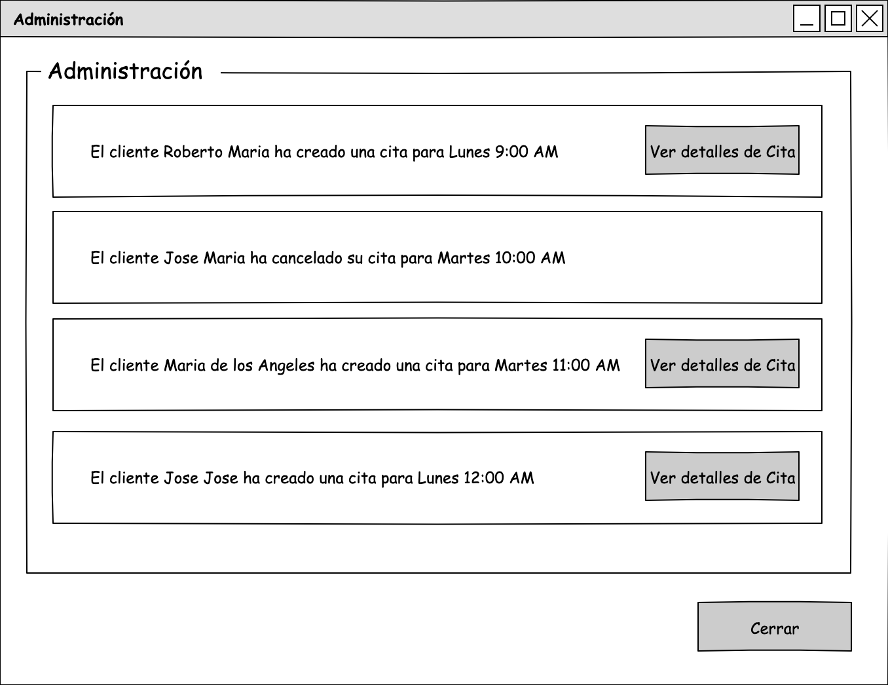

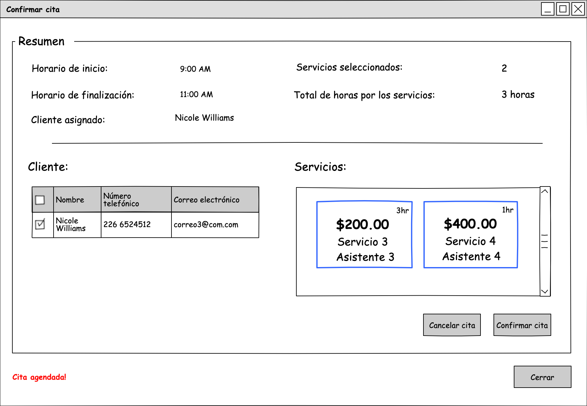

| Use-case field       | Description                                                                                                                                                                                                                                                                                                                                                                                                                                                                                                                                                 |
| -------------------- | ----------------------------------------------------------------------------------------------------------------------------------------------------------------------------------------------------------------------------------------------------------------------------------------------------------------------------------------------------------------------------------------------------------------------------------------------------------------------------------------------------------------------------------------------------------- |
| Use case name        | CA-03 Cancel appointment (Staff-Assisted)                                                                                                                                                                                                                                                                                                                                                                                                                                                                                                                   |
| Actors               | Staff                                                                                                                                                                                                                                                                                                                                                                                                                                                                                                                                                       |
| Use case overview    | A staff member cancels an appointment                                                                                                                                                                                                                                                                                                                                                                                                                                                                                                                       |
| Preconditions        | PRE-01: An APPOINTMENT is registered with status CONFIRMED                                                                                                                                                                                                                                                                                                                                                                                                                                                                                                  |
| Postcondition        | POST-01: The status of the APPOINTMENT is changed to "CANCELED",  POST-02: A notification is sent to the client about canceling the appointment.                                                                                                                                                                                                                                                                                                                                                                                                         |
| Trigger              | The Staff member selects an appointment and presses the button "Ver detalles" in the "Citas" window.                                                                                                                                                                                                                                                                                                                                                                                                                                                        |
| Use case description | NF-1: The System displays the "Ver detalles de cita" window with APPOINTMENT information. NF-2: The Staff presses the button "Cancelar cita" (AF-1). NF-3: The System shows a confirmation window and requests the ADMINISTRATOR's password   NF-4: The Staff enters the ADMINISTRATOR's password and presses the "Confirm" button. NF-5: The System removes the APPOINTMENT from the database  and notifies to Client that the appointment has been cancelled and displays a successful message. (EX-1, EX-2) NF-6: The use case ends here. |
| Alternative Flows    | **AF-1: The Staff cancels the operation:**  AF-1.1: The System close the window. AF-1.2: The use case ends here.                                                                                                                                                                                                                                                                                                                                                                                                                                      |
| Exception            | **EX-1: No internet connection** EX-1.1: The System displays an error message prompting the user to check their network connection and try again. EX-1.2: The use case ends here. **EX-2: Error to execute operation** EX-2.1: The System encounters an internal error (e.g., database failure, server timeout) and notifies the user of the issue, offering to retry the operation. EX-2.2: The use case ends here.                                                                                                                         |

| Use-case field       | Description                                                                                                                                                                                                                                                                                                                                                                                                                         |
| -------------------- | ----------------------------------------------------------------------------------------------------------------------------------------------------------------------------------------------------------------------------------------------------------------------------------------------------------------------------------------------------------------------------------------------------------------------------------- |
| Use case name        | CA-07 Cancel appointment (Client-self)                                                                                                                                                                                                                                                                                                                                                                                              |
| Actors               | Client                                                                                                                                                                                                                                                                                                                                                                                                                              |
| Use case overview    | A Client member cancels an appointment                                                                                                                                                                                                                                                                                                                                                                                              |
| Preconditions        | PRE-01: An APPOINTMENT is registered with status CONFIRMED                                                                                                                                                                                                                                                                                                                                                                          |
| Postcondition        | POST-01: The status of the APPOINTMENT is changed to "CANCELED",  POST-02: A notification is sent to the Staff about canceling the appointment.                                                                                                                                                                                                                                                                                  |
| Trigger              | The Client press the button "Cancelar cita" in the "Agendar cita" window                                                                                                                                                                                                                                                                                                                                                            |
| Use case description | NF-1: The System shows a confirmation window and requests the User's password   NF-2: The Client enters his password and presses the "Confirm" button. NF-3: The System removes the APPOINTMENT from the database  and notifies the Staff that the appointment has been cancelled and displays a successful message. (EX-1, EX-2) NF-4: The use case ends here.                                                            |
| Alternative Flows    | **AF-1: The Client cancels the operation:**  AF-1.1: The System close the window. AF-1.2: The use case ends here.                                                                                                                                                                                                                                                                                                             |
| Exception            | **EX-1: No internet connection** EX-1.1: The System displays an error message prompting the user to check their network connection and try again. EX-1.2: The use case ends here. **EX-2: Error to execute operation** EX-2.1: The System encounters an internal error (e.g., database failure, server timeout) and notifies the user of the issue, offering to retry the operation. EX-2.2: The use case ends here. |

| Use-case field       | Description                                                                                                                                                                                                                                                                                                                                                                                                                                                                                                                                                                 |
| -------------------- | --------------------------------------------------------------------------------------------------------------------------------------------------------------------------------------------------------------------------------------------------------------------------------------------------------------------------------------------------------------------------------------------------------------------------------------------------------------------------------------------------------------------------------------------------------------------------- |
| Use case name        | CA-04 Finalize appointment                                                                                                                                                                                                                                                                                                                                                                                                                                                                                                                                                  |
| Actors               | Staff                                                                                                                                                                                                                                                                                                                                                                                                                                                                                                                                                                       |
| Use case overview    | A staff member finalize an appointment. This use case is expected to be used when a staff finalize an appointment ahead of time and allow another clients to schedule appointments                                                                                                                                                                                                                                                                                                                                                                                          |
| Preconditions        | PRE-01: An APPOINTMENT is registered with status CONFIRMED                                                                                                                                                                                                                                                                                                                                                                                                                                                                                                                  |
| Postcondition        | POST-01: The status of the APPOINTMENT is changed to "FINISHED" POST-02: New notifications are created and sent to client about canceling the appointment                                                                                                                                                                                                                                                                                                                                                                                                                |
| Trigger              | The Staff member selects an appointment and presses the button "Ver detalles" in the "Citas" window.                                                                                                                                                                                                                                                                                                                                                                                                                                                                        |
| Use case description | NF-1: The System displays the "Ver detalles de cita" window with APPOINTMENT information. NF-2: The Staff presses the button "Finalizar cita" (AF-1). NF-3: The System shows a confirmation window and requests the ADMINISTRATOR's password   NF-4: The Staff enters the ADMINISTRATOR's password and presses the "Confirm" button. NF-5: The System removes the APPOINTMENT from the database  and notifies both the Staff and Client that the appointment has been finalized and display a successful message. (EX-1, EX-2) NF-6: The use case ends here. |
| Alternative Flows    | **AF-1: The Staff cancels the operation:**  AF-1.1: The System closes the window. AF-1.2: The use case ends here.                                                                                                                                                                                                                                                                                                                                                                                                                                                     |
| Exception            | **EX-1: No internet connection** EX-1.1: The System displays an error message prompting the user to check their network connection and try again. EX-1.2: The use case ends here. **EX-2: Error to execute operation** EX-2.1: The System encounters an internal error (e.g., database failure, server timeout) and notifies the user of the issue, offering to retry the operation. EX-2.2: The use case ends here.                                                                                                                                         |

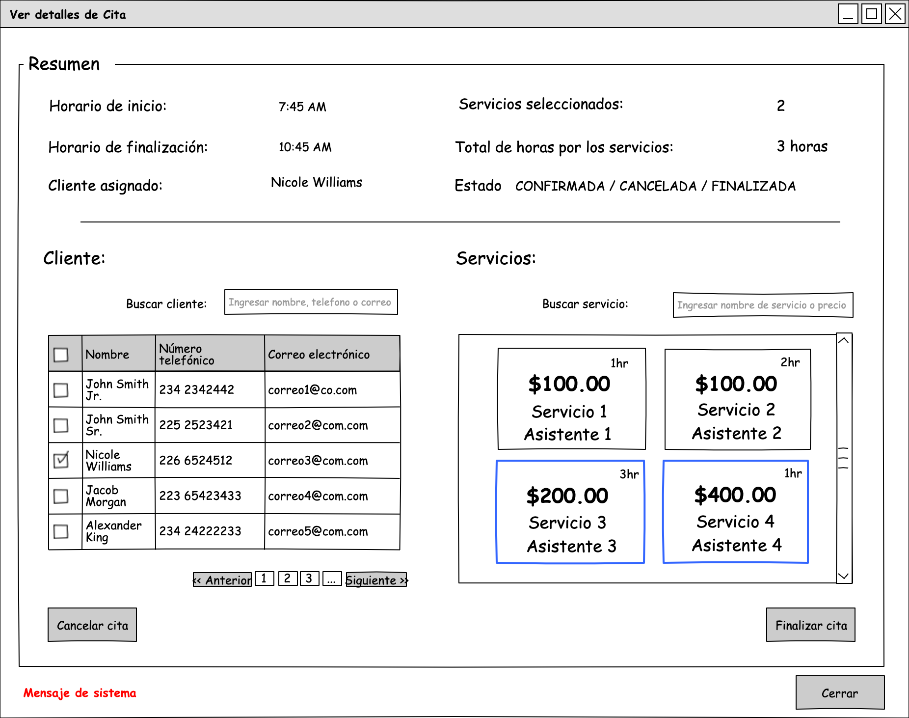

| Use-case field       | Description                                                                                                                                                                                                                                                                                                                                                                                                                                                                                                                                                                                                                                                                                                                                                                                                          |
| -------------------- | -------------------------------------------------------------------------------------------------------------------------------------------------------------------------------------------------------------------------------------------------------------------------------------------------------------------------------------------------------------------------------------------------------------------------------------------------------------------------------------------------------------------------------------------------------------------------------------------------------------------------------------------------------------------------------------------------------------------------------------------------------------------------------------------------------------------- |
| Use case name        | CA-02 Edit appointment                                                                                                                                                                                                                                                                                                                                                                                                                                                                                                                                                                                                                                                                                                                                                                                               |
| Actors               | Staff                                                                                                                                                                                                                                                                                                                                                                                                                                                                                                                                                                                                                                                                                                                                                                                                                |
| Use case overview    | A staff member edits an appointment to change the client or services within the selected time range.                                                                                                                                                                                                                                                                                                                                                                                                                                                                                                                                                                                                                                                                                                                 |
| Preconditions        | PRE-01: An APPOINTMENT is registered with status CONFIRMED                                                                                                                                                                                                                                                                                                                                                                                                                                                                                                                                                                                                                                                                                                                                                           |
| Postcondition        | POST-01: New notifications are created and sent to the client regarding the appointment update                                                                                                                                                                                                                                                                                                                                                                                                                                                                                                                                                                                                                                                                                                                       |
| Trigger              | The Staff member selects an appointment and presses the button "Editar cita" in the "Cita" window.                                                                                                                                                                                                                                                                                                                                                                                                                                                                                                                                                                                                                                                                                                                   |
| Use case description | NF-1: The System displays the "Editar cita" window with APPOINTMENT information. NF-2: The Staff provides the new information and presses the button "Aceptar" (AF-1) NF-3: The System shows a confirmation window and requests the STAFF's password   NF-4: The Staff enters the STAFF's password and presses the "Confirm" button. NF-5: The System validates information (AF-2), checks SERVICES and CLIENT availability (AF-3, AF-4, AF-5) and update APPOINTMENT (EX-1, EX-2) NF-6: The use case ends here.                                                                                                                                                                                                                                                                                      |
| Alternative Flows    | **AF-1: The Staff cancels the operation:**  AF-1.1: The System closes the window. AF-1.2: The use case ends here. **AF-2: The Client has provided invalid data:** AF-2.1: The System notifies the Client has provided invalid data and prompts them to send valid data. AF-2.2: The use case flow returns to NF-2 **AF-3: The SERVICE has been disabled or deleted.** AF-3.1: The System notifies the Client that the SERVICE has been disabled or deleted and removes SERVICE from selected SERVICES in the "Editar Cita" window. **AF-4: The ASSISTANT has been disabled or deleted.** AF-4.1: The System notifies the Client that the ASSISTANT has been disabled or deleted and removes any SERVICE assigned to the ASSISTANT from the selected SERVICES in the "Editar cita" window. |
| Exception            | **EX-1: No internet connection** EX-1.1: The System displays an error message prompting the user to check their network connection and try again. EX-1.2: The use case ends here. **EX-2: Error to execute operation** EX-2.1: The System encounters an internal error (e.g., database failure, server timeout) and notifies the user of the issue, offering to retry the operation. EX-2.2: The use case ends here.                                                                                                                                                                                                                                                                                                                                                                                  |

#### Availability Module

| Use-case field       | Description                                                                                                                                                                                                                                                                                                                                                                                                                                                                                                                                                                                                                                                                                                                                                                                                            |
| -------------------- | ---------------------------------------------------------------------------------------------------------------------------------------------------------------------------------------------------------------------------------------------------------------------------------------------------------------------------------------------------------------------------------------------------------------------------------------------------------------------------------------------------------------------------------------------------------------------------------------------------------------------------------------------------------------------------------------------------------------------------------------------------------------------------------------------------------------------- |
| Use case name        | CB-1 Assign availability time slot                                                                                                                                                                                                                                                                                                                                                                                                                                                                                                                                                                                                                                                                                                                                                                                     |
| Actors               | Administrator                                                                                                                                                                                                                                                                                                                                                                                                                                                                                                                                                                                                                                                                                                                                                                                                          |
| Use case overview    | The Administrator sets availability time slots for an assistant. This use case is essential to allow clients to view available services, select a specific assistant, and book appointments during the available time slots.                                                                                                                                                                                                                                                                                                                                                                                                                                                                                                                                                                                           |
| Preconditions        | PRE-01: An ASSISTANT must be registered. PRE-02: A SERVICE must be registered and assigned to an ASSISTANT                                                                                                                                                                                                                                                                                                                                                                                                                                                                                                                                                                                                                                                                                                          |
| Postcondition        | POST-01: An AVAILABILITY TIME SLOT is successfully registered.                                                                                                                                                                                                                                                                                                                                                                                                                                                                                                                                                                                                                                                                                                                                                         |
| Trigger              | The Administrator selects a time range OR/AND presses the button "Asignar disponibilidad" in the "Disponibilidad de horarios" window                                                                                                                                                                                                                                                                                                                                                                                                                                                                                                                                                                                                                                                                                   |
| Use case description | NF-1: The System displays the "Asignar disponibilidad a asistentes" window with date, startTime and endTime assigned in case of selected time range. NF-2: The Administrator provides information and presses the "Asignar" button. (AF-4) NF-3: The System validates information (AF-1), checks the status of the ASSISTANT (AF-2), checks if the ASSISTANT is available within the AVAILABILITY TIME SLOT (AF-3), registers new AVAILABILITY TIME SLOT and displays a successful message with a summary of the details. (EX-1, EX-2).                                                                                                                                                                                                                                                                          |
| Alternative Flows    | **AF-1 The data are invalid:** AF-1.1: The System notifies the Administrator has provided invalid data and prompts him to send valid data. AF-1.2: The use case flow returns to NF-2. **AF-2: The ASSISTANT has been disabled or deleted.** AF-2.1: The System notifies the Administrator that the ASSISTANT has been disabled or deleted. AF-2.2: The use case flow returns to NF-2 **AF-3: The ASSISTANT has already assigned an AVAILABILITY TIME SLOT:** AF-3.1: The System notifies the Administrator that the ASSISTANT has already registered a AVAILABILITY TIME SLOT with the detail of the existing slots. AF-3.2: The use case flow returns to NF-2 AF-4: The Administrator cancels the operation AF-4.1: The System close the window. AF-4.2: The use use case ends here. |
| Exception            | **EX-1: No internet connection** EX-1.1: The System displays an error message prompting the user to check their network connection and try again. EX-1.2: The use case ends here. **EX-2: Error to execute operation** EX-2.1: The System encounters an internal error (e.g., database failure, server timeout) and notifies the user of the issue, offering to retry the operation. EX-2.2: The use case ends here.                                                                                                                                                                                                                                                                                                                                                                                    |

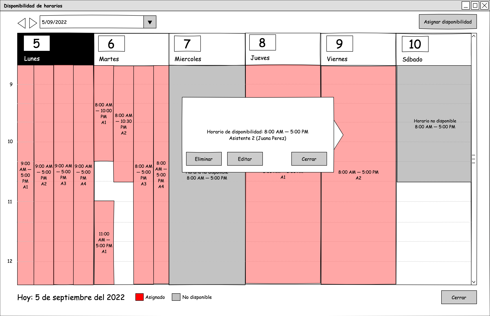

| Use-case field       | Description                                                                                                                                                                                                                                                                                                                                                                                                                                                                                                                                                                                                                                                                                                                                                                                                            |
| -------------------- | ---------------------------------------------------------------------------------------------------------------------------------------------------------------------------------------------------------------------------------------------------------------------------------------------------------------------------------------------------------------------------------------------------------------------------------------------------------------------------------------------------------------------------------------------------------------------------------------------------------------------------------------------------------------------------------------------------------------------------------------------------------------------------------------------------------------------- |
| Use case name        | CB-3 Edit Availability                                                                                                                                                                                                                                                                                                                                                                                                                                                                                                                                                                                                                                                                                                                                                                                                 |
| Actors               | Administrator                                                                                                                                                                                                                                                                                                                                                                                                                                                                                                                                                                                                                                                                                                                                                                                                          |
| Use case overview    | The administrator updates the availability time slots for an assistant. This use case is essential for modifying the periods during which an assistant is available for scheduling.                                                                                                                                                                                                                                                                                                                                                                                                                                                                                                                                                                                                                                    |
| Preconditions        | PRE-01: An ASSISTANT must be registered. PRE-02: The ASSISTANT must not already have an  AVAILABILITY TIME SLOT registered within the provided time range                                                                                                                                                                                                                                                                                                                                                                                                                                                                                                                                                                                                                                                           |
| Postcondition        | POST-01: An AVAILABILITY TIME SLOT is successfully updated.                                                                                                                                                                                                                                                                                                                                                                                                                                                                                                                                                                                                                                                                                                                                                            |
| Trigger              | The Administrator selects an AVAILABILITY TIME SLOT  and presses the button "Editar" in the "Disponibilidad de horarios" window                                                                                                                                                                                                                                                                                                                                                                                                                                                                                                                                                                                                                                                                                        |
| Use case description | NF-1: The System displays the "Editar disponibilidad a asistente" window with date, startTime and endTime assigned. NF-2: The Administrator provides information and presses the "Editar" button. (AF-4) NF-3: The System validates information (AF-1), checks the status of the ASSISTANT (AF-2), checks if the ASSISTANT is available within the AVAILABILITY TIME SLOT (AF-3), update AVAILABILITY TIME SLOT and displays a successful message with a summary of the details. (EX-1, EX-2).                                                                                                                                                                                                                                                                                                                   |
| Alternative Flows    | **AF-1 The data are invalid:** AF-1.1: The System notifies the Administrator has provided invalid data and prompts him to send valid data. AF-1.2: The use case flow returns to NF-2. **AF-2: The ASSISTANT has been disabled or deleted.** AF-2.1: The System notifies the Administrator that the ASSISTANT has been disabled or deleted. AF-2.2: The use case flow returns to NF-2 **AF-3: The ASSISTANT has already assigned an AVAILABILITY TIME SLOT:** AF-3.1: The System notifies the Administrator that the ASSISTANT has already registered a AVAILABILITY TIME SLOT with the detail of the existing slots. AF-3.2: The use case flow returns to NF-2 AF-4: The Administrator cancels the operation AF-4.1: The System close the window. AF-4.2: The use use case ends here. |
| Exception            | **EX-1: No internet connection** EX-1.1: The System displays an error message prompting the user to check their network connection and try again. EX-1.2: The use case ends here. **EX-2: Error to execute operation** EX-2.1: The System encounters an internal error (e.g., database failure, server timeout) and notifies the user of the issue, offering to retry the operation. EX-2.2: The use case ends here.                                                                                                                                                                                                                                                                                                                                                                                    |

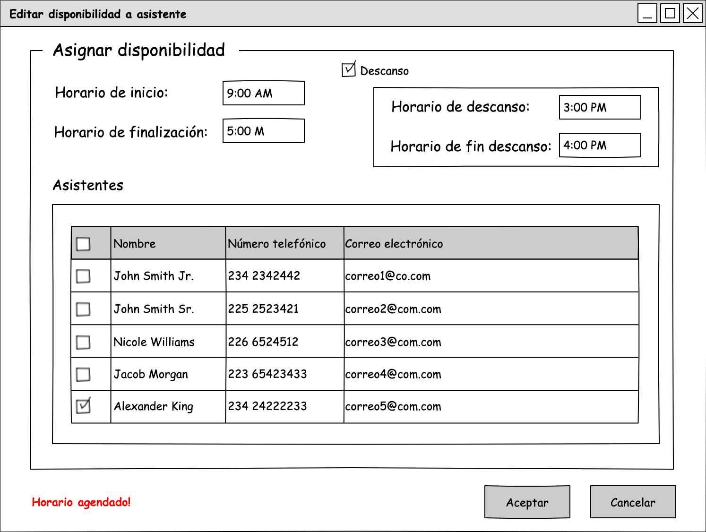

| Use-case field       | Description                                                                                                                                                                                                                                                                                                                                                                                                                                    |
| -------------------- | ---------------------------------------------------------------------------------------------------------------------------------------------------------------------------------------------------------------------------------------------------------------------------------------------------------------------------------------------------------------------------------------------------------------------------------------------- |
| Use case name        | CB-2 Delete Availability Slot                                                                                                                                                                                                                                                                                                                                                                                                                  |
| Actors               | Administrator                                                                                                                                                                                                                                                                                                                                                                                                                                  |
| Use case overview    | The administrator removes the availability time slots for an assistant. This use case is essential for canceling a time slot.                                                                                                                                                                                                                                                                                                                  |
| Preconditions        | PRE-01: An ASSISTANT must be registered. PRE-02: The ASSISTANT must have registered an  AVAILABILITY TIME SLOT                                                                                                                                                                                                                                                                                                                              |
| Postcondition        | POST-01: An AVAILABILITY TIME SLOT is successfully deleted.                                                                                                                                                                                                                                                                                                                                                                                    |
| Trigger              | The Administrator selects an AVAILABILITY TIME SLOT  and presses the button "Eliminar" in the "Disponibilidad de horarios" window                                                                                                                                                                                                                                                                                                              |
| Use case description | NF-1: The System shows a confirmation window and requests the ADMINISTRATOR's password   NF-2: The Administrator enters the ADMINISTRATOR's password and presses the "Confirm" button. (AF-1) NF-3: The System removes the AVAILABILITY TIME SLOT from the database and displays a successful message and removes the AVAILABILITY TIME SLOT from the "Disponibilidad de horarios" window (EX-1, EX-2). NF-4: The use case ends here. |
| Alternative Flows    | AF-1: The Administrator cancels the operation AF-1.1: The System close the window. AF-1.2: The use use case ends here.                                                                                                                                                                                                                                                                                                                   |
| Exception            | **EX-1: No internet connection** EX-1.1: The System displays an error message prompting the user to check their network connection and try again. EX-1.2: The use case ends here. **EX-2: Error to execute operation** EX-2.1: The System encounters an internal error (e.g., database failure, server timeout) and notifies the user of the issue, offering to retry the operation. EX-2.2: The use case ends here.            |

#### Assistant Module

| Use-case field       | Description                                                                                                                                                                                                                                                                                                                                                                                                                                                                                                                               |
| -------------------- | ----------------------------------------------------------------------------------------------------------------------------------------------------------------------------------------------------------------------------------------------------------------------------------------------------------------------------------------------------------------------------------------------------------------------------------------------------------------------------------------------------------------------------------------- |
| Use case name        | CC-1 Register Assistant                                                                                                                                                                                                                                                                                                                                                                                                                                                                                                                   |
| Actors               | Administrator                                                                                                                                                                                                                                                                                                                                                                                                                                                                                                                             |
| Use case overview    | The Administrator registers a new assistant to allow him to attend to their clients.                                                                                                                                                                                                                                                                                                                                                                                                                                                      |
| Preconditions        | PRE-01: The ASSISTANT data must not have already registered.                                                                                                                                                                                                                                                                                                                                                                                                                                                                              |
| Postcondition        | POST-01: An ASSISTANT is succesfully registered.                                                                                                                                                                                                                                                                                                                                                                                                                                                                                          |
| Trigger              | The Administrator presses the button "Registrar" in the "Asistentes" window.                                                                                                                                                                                                                                                                                                                                                                                                                                                              |
| Use case description | NF-1: The System displays the "Registrar asistente" window and gets the Services registered (EX-1, EX-2). NF-2: The Administrator provides the information and presses the button "Aceptar" (AF-1) NF-3: The System validates the information (AF-2), checks for duplication on data (AF-3), registers a new ASSISTANT in the database and displays a successful message (EX-1, EX-2) NF-4: The use case ends here.                                                                                                              |
| Alternative Flows    | **AF-1: The Administrator cancels the operation** AF-1.1: The System close the window. AF-1.2: The use use case ends here. **AF-2 The data are invalid:** AF-2.1: The System notifies the Administrator has provided invalid data and prompts him to send valid data. AF-2.2: The use case flow returns to NF-2. AF-3: Assistant already registered: AF-3.1 The System notifies the Administrator has provided already registered data and prompts him to change data. AF-3.2: The use case flow returns to NF-2. |
| Exception            | **EX-1: No internet connection** EX-1.1: The System displays an error message prompting the user to check their network connection and try again. EX-1.2: The use case ends here. **EX-2: Error to execute operation** EX-2.1: The System encounters an internal error (e.g., database failure, server timeout) and notifies the user of the issue, offering to retry the operation. EX-2.2: The use case ends here.                                                                                                       |

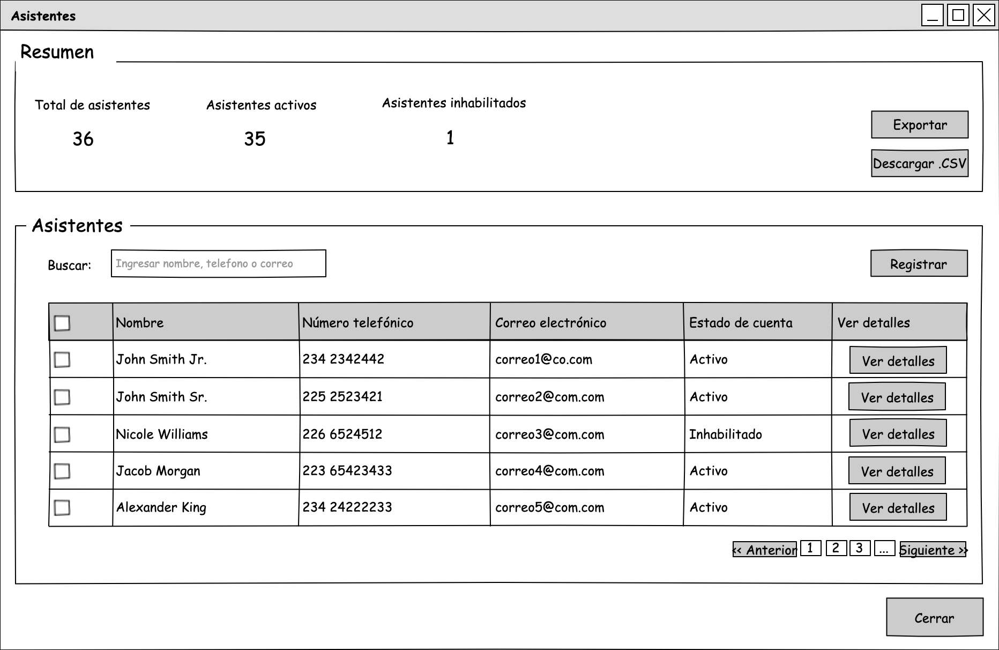

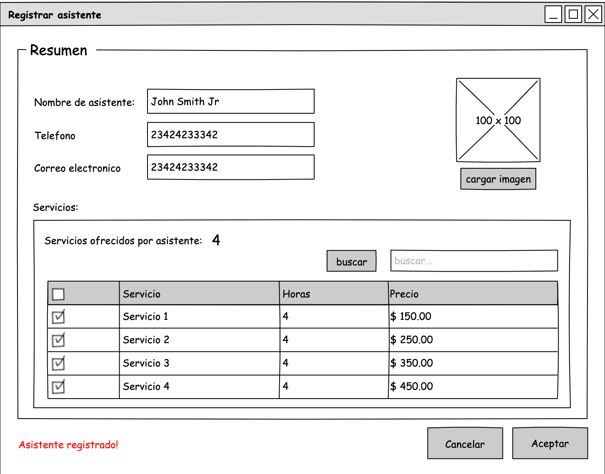

| Use-case field       | Description                                                                                                                                                                                                                                                                                                                                                                                                                                                                                                                                                                                                               |
| -------------------- | ------------------------------------------------------------------------------------------------------------------------------------------------------------------------------------------------------------------------------------------------------------------------------------------------------------------------------------------------------------------------------------------------------------------------------------------------------------------------------------------------------------------------------------------------------------------------------------------------------------------------- |
| Use case name        | CC-2 Edit Assistant                                                                                                                                                                                                                                                                                                                                                                                                                                                                                                                                                                                                       |
| Actors               | Administrator                                                                                                                                                                                                                                                                                                                                                                                                                                                                                                                                                                                                             |
| Use case overview    | The Administrator updates information of assistant.                                                                                                                                                                                                                                                                                                                                                                                                                                                                                                                                                                       |
| Preconditions        | PRE-01: The ASSISTANT must be registered.                                                                                                                                                                                                                                                                                                                                                                                                                                                                                                                                                                                 |
| Postcondition        | POST-01: An ASSISTANT is successfully updated.                                                                                                                                                                                                                                                                                                                                                                                                                                                                                                                                                                            |
| Trigger              | The Administrator presses the button "Editar asistente" in the "Asistentes" window.                                                                                                                                                                                                                                                                                                                                                                                                                                                                                                                                       |
| Use case description | NF-1: The System displays the "Editar asistente" window and gets the Services assigned to Assistant (EX-1, EX-2). NF-2: The Administrator provides the information and presses the button "Aceptar" (AF-1, AF-3) NF-3: The System validates the information (AF-2), checks for duplication on data (AF-3), updates ASSISTANT in the database and displays a successful message (EX-1, EX-2) NF-4: The use case ends here.                                                                                                                                                                                        |
| Alternative Flows    | **AF-1: The Administrator cancels the operation** AF-1.1: The System close the window. AF-1.2: The use use case ends here. **AF-2 The data are invalid:** AF-2.1: The System notifies the Administrator has provided invalid data and prompts him to send valid data. AF-2.2: The use case flow returns to NF-2. **AF-3: The Administrator selects new services** AF-3.1: The System gets all the services registered and displays the "Añadir servicios" window. AF-3.2: The Administrator selects the new services and press the button "Aceptar" AF-3.3: The use case flow returns to NF-2. |
| Exception            | **EX-1: No internet connection** EX-1.1: The System displays an error message prompting the user to check their network connection and try again. EX-1.2: The use case ends here. **EX-2: Error to execute operation** EX-2.1: The System encounters an internal error (e.g., database failure, server timeout) and notifies the user of the issue, offering to retry the operation. EX-2.2: The use case ends here.                                                                                                                                                                                       |

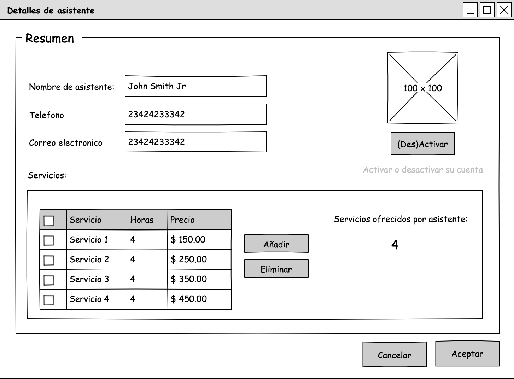

| Use-case field       | Description                                                                                                                                                                                                                                                                                                                                                                                                                                                                                                                                                                                                                                  |
| -------------------- | -------------------------------------------------------------------------------------------------------------------------------------------------------------------------------------------------------------------------------------------------------------------------------------------------------------------------------------------------------------------------------------------------------------------------------------------------------------------------------------------------------------------------------------------------------------------------------------------------------------------------------------------- |
| Use case name        | CC-3 Disable Assistant                                                                                                                                                                                                                                                                                                                                                                                                                                                                                                                                                                                                                       |
| Actors               | Administrator                                                                                                                                                                                                                                                                                                                                                                                                                                                                                                                                                                                                                                |
| Use case overview    | The Administrator disables Assistant to avoid to login to the system.                                                                                                                                                                                                                                                                                                                                                                                                                                                                                                                                                                        |
| Preconditions        | PRE-01: The ASSISTANT must be registered. PRE-02: The ASSISTANT must have ENABLED state.                                                                                                                                                                                                                                                                                                                                                                                                                                                                                                                                                  |
| Postcondition        | POST-01: The status of ASSISTANT is changed to DISABLED POST-02: The ASSISTANT's AVAILABILITY TIME SLOTS are removed POST-03: The ASSISTANT's APPOINTMENTS are removed                                                                                                                                                                                                                                                                                                                                                                                                                                                                 |
| Trigger              | The Administrator presses the button "Editar asistente" in the "Asistentes" window.                                                                                                                                                                                                                                                                                                                                                                                                                                                                                                                                                          |
| Use case description | NF-1: The System displays the "Editar asistente" window and gets the Services assigned to Assistant (EX-1, EX-2). NF-2: The Administrator presses the button "Desactivar" (AF-1) NF-3: The System shows a confirmation window and requests the ADMINISTRATOR's password   NF-3: The Administrator enters the ADMINISTRATOR's password and presses the "Confirm" button. (AF-1) NF-4: The System validates the information (AF-2), checks the ASSISTANT status (AF-3), removes the ASSISTANT's APPOINTMENTS and AVAILABILITY TIME SLOTS registered and displays a successful message (EX-1,EX-2) NF-5: The use case ends here. |
| Alternative Flows    | **AF-1: The Administrator cancels the operation** AF-1.1: The System close the window. AF-1.2: The use use case ends here. **AF-2 The data are invalid:** AF-2.1: The System notifies the Administrator has provided invalid data and prompts him to send valid data. AF-2.2: The use case flow returns to NF-2. **AF-3: The ASSISTANT is already disabled.** AF-3.1: The System notifies the Administrator that the ASSISTANT is already disabled. AF-3.2: The use case flow returns to NF-2.                                                                                                                    |
| Exception            | **EX-1: No internet connection** EX-1.1: The System displays an error message prompting the user to check their network connection and try again. EX-1.2: The use case ends here. **EX-2: Error to execute operation** EX-2.1: The System encounters an internal error (e.g., database failure, server timeout) and notifies the user of the issue, offering to retry the operation. EX-2.2: The use case ends here.                                                                                                                                                                                                          |

| Use-case field       | Description                                                                                                                                                                                                                                                                                                                                                                                                                                                                                                                                                                |
| -------------------- | -------------------------------------------------------------------------------------------------------------------------------------------------------------------------------------------------------------------------------------------------------------------------------------------------------------------------------------------------------------------------------------------------------------------------------------------------------------------------------------------------------------------------------------------------------------------------- |
| Use case name        | CC-4 Enable Assistant                                                                                                                                                                                                                                                                                                                                                                                                                                                                                                                                                      |
| Actors               | Administrator                                                                                                                                                                                                                                                                                                                                                                                                                                                                                                                                                              |
| Use case overview    | The Administrator enables Assistant to avoid to login to the system.                                                                                                                                                                                                                                                                                                                                                                                                                                                                                                       |
| Preconditions        | PRE-01: The ASSISTANT must be registered. PRE-02: The ASSISTANT must have DISABLED state.                                                                                                                                                                                                                                                                                                                                                                                                                                                                               |
| Postcondition        | POST-01: The status of ASSISTANT is changed to DISABLED                                                                                                                                                                                                                                                                                                                                                                                                                                                                                                                    |
| Trigger              | The Administrator presses the button "Editar asistente" in the "Asistentes" window.                                                                                                                                                                                                                                                                                                                                                                                                                                                                                        |
| Use case description | NF-1: The System displays the "Editar asistente" window and gets the Services assigned to Assistant (EX-1, EX-2). NF-2: The Administrator presses the button "Activar" (AF-1) NF-3: The System shows a confirmation window and requests the ADMINISTRATOR's password   NF-3: The Administrator enters the ADMINISTRATOR's password and presses the "Confirm" button. (AF-1) NF-4: The System validates the information (AF-2), checks the ASSISTANT status (AF-3) and changes the status to ENABLED of ASSISTANT (EX-1,EX-2). NF-5: The use case ends here. |
| Alternative Flows    | **AF-1: The Administrator cancels the operation** AF-1.1: The System close the window. AF-1.2: The use use case ends here. **AF-2 The data are invalid:** AF-2.1: The System notifies the Administrator has provided invalid data and prompts him to send valid data. AF-2.2: The use case flow returns to NF-2. **AF-3: The ASSISTANT is already enabled.** AF-3.1: The System notifies the Administrator that the ASSISTANT is already enabled. AF-3.2: The use case flow returns to NF-2.                                                    |
| Exception            | **EX-1: No internet connection** EX-1.1: The System displays an error message prompting the user to check their network connection and try again. EX-1.2: The use case ends here. **EX-2: Error to execute operation** EX-2.1: The System encounters an internal error (e.g., database failure, server timeout) and notifies the user of the issue, offering to retry the operation. EX-2.2: The use case ends here.                                                                                                                                        |

#### Services Module

| Use-case field       | Description                                                                                                                                                                                                                                                                                                                                                                                                                         |
| -------------------- | ----------------------------------------------------------------------------------------------------------------------------------------------------------------------------------------------------------------------------------------------------------------------------------------------------------------------------------------------------------------------------------------------------------------------------------- |
| Use case name        | CD-1 Register Service                                                                                                                                                                                                                                                                                                                                                                                                               |
| Actors               | Administrator                                                                                                                                                                                                                                                                                                                                                                                                                       |
| Use case overview    | The Administrator registers a new Service to assign to assistants                                                                                                                                                                                                                                                                                                                                                                   |
| Preconditions        |                                                                                                                                                                                                                                                                                                                                                                                                                                     |
| Postcondition        | POST-01: A SERVICE has been registered.                                                                                                                                                                                                                                                                                                                                                                                             |
| Trigger              | The Administrator presses the button "Registrar" in the "Servicios" window.                                                                                                                                                                                                                                                                                                                                                         |
| Use case description | NF-1: The System displays the "Registrar servicio" window. NF-2: The Administrator provides the information and presses the button "Registrar" (AF-1) NF-3: The System validates the information (AF-2), register a new SERVICE in the database and displays a successful message (EX-1, EX-2) NF-4: The use case ends here.                                                                                               |
| Alternative Flows    | **AF-1: The Administrator cancels the operation** AF-1.1: The System close the window. AF-1.2: The use use case ends here. **AF-2 The data are invalid:** AF-2.1: The System notifies the Administrator has provided invalid data and prompts him to send valid data. AF-2.2: The use case flow returns to NF-2.                                                                                                     |
| Exception            | **EX-1: No internet connection** EX-1.1: The System displays an error message prompting the user to check their network connection and try again. EX-1.2: The use case ends here. **EX-2: Error to execute operation** EX-2.1: The System encounters an internal error (e.g., database failure, server timeout) and notifies the user of the issue, offering to retry the operation. EX-2.2: The use case ends here. |

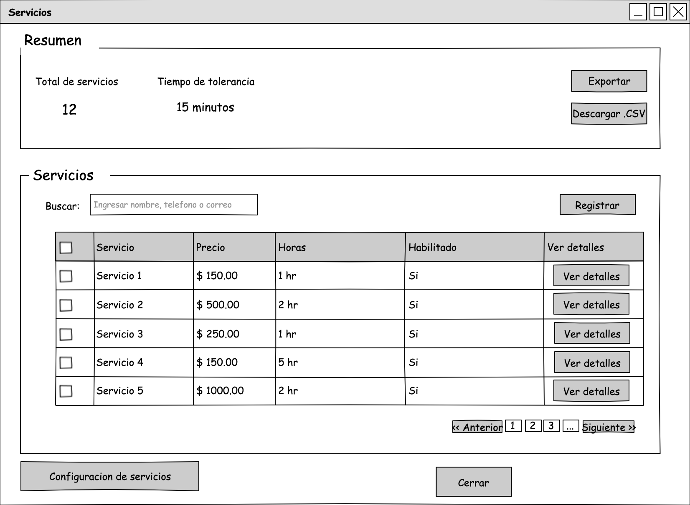

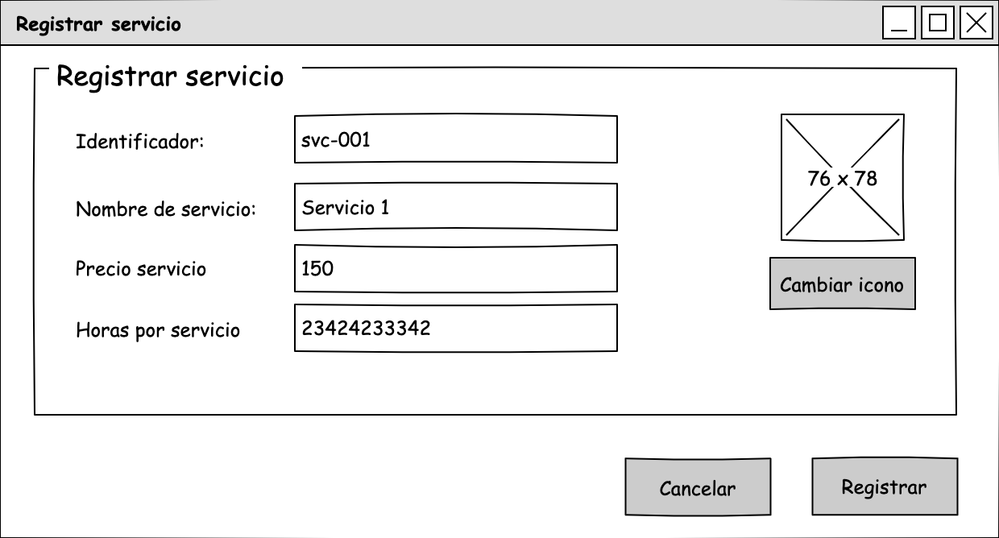

| Use-case field       | Description                                                                                                                                                                                                                                                                                                                                                                                                                                                                                                            |
| -------------------- | ---------------------------------------------------------------------------------------------------------------------------------------------------------------------------------------------------------------------------------------------------------------------------------------------------------------------------------------------------------------------------------------------------------------------------------------------------------------------------------------------------------------------- |
| Use case name        | CD-2 Disable Service                                                                                                                                                                                                                                                                                                                                                                                                                                                                                                   |
| Actors               | Administrator                                                                                                                                                                                                                                                                                                                                                                                                                                                                                                          |
| Use case overview    | The Administrator disables a Service to prevent clients from scheduling appointments for it in future bookings.                                                                                                                                                                                                                                                                                                                                                                                                        |
| Preconditions        | PRE-01: The SERVICE must be registered. PRE-02: The SERVICE must have status ENABLED                                                                                                                                                                                                                                                                                                                                                                                                                                |
| Postcondition        | POST-01: The status of SERVICE is changed to DISABLED POST-02: The future bookings cannot have assigned the SERVICE disabled.                                                                                                                                                                                                                                                                                                                                                                                       |
| Trigger              | The Administrator presses the button "Editar servicio" in the "Servicios" window.                                                                                                                                                                                                                                                                                                                                                                                                                                      |
| Use case description | NF-1: The System displays the "Editar servicio" window. NF-2: The Administrator presses the button "Desactivar" (AF-1) NF-3: The System shows a confirmation window and requests the ADMINISTRATOR's password   NF-3: The Administrator enters the ADMINISTRATOR's password and presses the "Confirm" button. NF-4: The System validates the information (AF-2), checks the SERVICE status (AF-3) and updates the status of the SERVICE to DISABLED (EX-1,EX-2) NF-5: The use case ends here.           |
| Alternative Flows    | **AF-1: The Administrator cancels the operation** AF-1.1: The System close the window. AF-1.2: The use use case ends here. **AF-2 The data are invalid:** AF-2.1: The System notifies the Administrator has provided invalid data and prompts him to send valid data. AF-2.2: The use case flow returns to NF-2. **AF-3: The SERVICE is already disabled.** AF-3.1: The System notifies the Administrator that the SERVICE is already disabled. AF-3.2: The use case flow returns to NF-2.  |
| Exception            | **EX-1: No internet connection** EX-1.1: The System displays an error message prompting the user to check their network connection and try again. EX-1.2: The use case ends here. **EX-2: Error to execute operation** EX-2.1: The System encounters an internal error (e.g., database failure, server timeout) and notifies the user of the issue, offering to retry the operation. EX-2.2: The use case ends here.                                                                                    |

| Use-case field       | Description                                                                                                                                                                                                                                                                                                                                                                                                                                                                                                       |
| -------------------- | ----------------------------------------------------------------------------------------------------------------------------------------------------------------------------------------------------------------------------------------------------------------------------------------------------------------------------------------------------------------------------------------------------------------------------------------------------------------------------------------------------------------- |
| Use case name        | CD-2 Enable Service                                                                                                                                                                                                                                                                                                                                                                                                                                                                                               |
| Actors               | Administrator                                                                                                                                                                                                                                                                                                                                                                                                                                                                                                     |
| Use case overview    | The Administrator disables a Service to allow clients to schedule appointments with the service                                                                                                                                                                                                                                                                                                                                                                                                                   |
| Preconditions        | PRE-01: The SERVICE must be registered. PRE-02: The SERVICE must have status DISABLED                                                                                                                                                                                                                                                                                                                                                                                                                          |
| Postcondition        | POST-01: The status of SERVICE is changed to ENABLED                                                                                                                                                                                                                                                                                                                                                                                                                                                              |
| Trigger              | The Administrator presses the button "Editar servicio" in the "Servicios" window.                                                                                                                                                                                                                                                                                                                                                                                                                                 |
| Use case description | NF-1: The System displays the "Editar servicio" window. NF-2: The Administrator presses the button "Activar" (AF-1) NF-3: The System shows a confirmation window and requests the ADMINISTRATOR's password   NF-3: The Administrator enters the ADMINISTRATOR's password and presses the "Confirm" button. NF-4: The System validates the information (AF-2), checks the SERVICE status (AF-3) and updates the status of the SERVICE to ENABLED (EX-1,EX-2) NF-5: The use case ends here.          |
| Alternative Flows    | **AF-1: The Administrator cancels the operation** AF-1.1: The System close the window. AF-1.2: The use use case ends here. **AF-2 The data are invalid:** AF-2.1: The System notifies the Administrator has provided invalid data and prompts him to send valid data. AF-2.2: The use case flow returns to NF-2. **AF-3: The SERVICE is already enabled.** AF-3.1: The System notifies the Administrator that the SERVICE is already disabled. AF-3.2: The use case flow returns to NF-2. |
| Exception            | **EX-1: No internet connection** EX-1.1: The System displays an error message prompting the user to check their network connection and try again. EX-1.2: The use case ends here. **EX-2: Error to execute operation** EX-2.1: The System encounters an internal error (e.g., database failure, server timeout) and notifies the user of the issue, offering to retry the operation. EX-2.2: The use case ends here.                                                                               |

| Use-case field       | Description                                                                                                                                                                                                                                                                                                                                                                                                                                                            |
| -------------------- | ---------------------------------------------------------------------------------------------------------------------------------------------------------------------------------------------------------------------------------------------------------------------------------------------------------------------------------------------------------------------------------------------------------------------------------------------------------------------- |
| Use case name        | CD-4 Delete Service                                                                                                                                                                                                                                                                                                                                                                                                                                                    |
| Actors               | Administrator                                                                                                                                                                                                                                                                                                                                                                                                                                                          |
| Use case overview    | The administrator removes a Service from the system.                                                                                                                                                                                                                                                                                                                                                                                                                   |
| Preconditions        | PRE-01: A SERVICE must be registered.                                                                                                                                                                                                                                                                                                                                                                                                                                  |
| Postcondition        | POST-01: A SERVICE is successfully deleted.                                                                                                                                                                                                                                                                                                                                                                                                                            |
| Trigger              | The Administrator selects a SERVICE and presses the button "Editar" in the "Servicios" window.                                                                                                                                                                                                                                                                                                                                                                         |
| Use case description | NF-1: The System displays the "Editar servicio" window. NF-2: The Administrator presses the button "Eliminar" (AF-1) NF-3: The System shows a confirmation window and requests the ADMINISTRATOR's password   NF-4: The Administrator enters the ADMINISTRATOR's password and presses the "Confirm" button. (AF-1) NF-5: The System removes the SERVICE from the database and displays a successful message (EX-1, EX-2). NF-6: The use case ends here. |
| Alternative Flows    | **AF-1: The Administrator cancels the operation** AF-1.1: The System close the window. AF-1.2: The use use case ends here.                                                                                                                                                                                                                                                                                                                                       |
| Exception            | **EX-1: No internet connection** EX-1.1: The System displays an error message prompting the user to check their network connection and try again. EX-1.2: The use case ends here. **EX-2: Error to execute operation** EX-2.1: The System encounters an internal error (e.g., database failure, server timeout) and notifies the user of the issue, offering to retry the operation. EX-2.2: The use case ends here.                                    |

| Use-case field       | Description                                                                                                                                                                                                                                                                                                                                                                                                                         |
| -------------------- | ----------------------------------------------------------------------------------------------------------------------------------------------------------------------------------------------------------------------------------------------------------------------------------------------------------------------------------------------------------------------------------------------------------------------------------- |
| Use case name        | CD-5 Edit Service                                                                                                                                                                                                                                                                                                                                                                                                                   |
| Actors               | Administrator                                                                                                                                                                                                                                                                                                                                                                                                                       |
| Use case overview    | The Administrator updates information of Service.                                                                                                                                                                                                                                                                                                                                                                                   |
| Preconditions        | PRE-01: The SERVICE must be registered.                                                                                                                                                                                                                                                                                                                                                                                             |
| Postcondition        | POST-01: A SERVICE is successfully updated.                                                                                                                                                                                                                                                                                                                                                                                         |
| Trigger              | The Administrator presses the button "Editar servicio" in the "Servicios" window.                                                                                                                                                                                                                                                                                                                                                   |
| Use case description | NF-1: The System displays the "Editar servicio" window. NF-2: The Administrator provides the information and presses the button "Aceptar" (AF-1) NF-3: The System validates the information (AF-2), updates SERVICE in the database and displays a successful message (EX-1, EX-2) NF-4: The use case ends here.                                                                                                           |
| Alternative Flows    | **AF-1: The Administrator cancels the operation** AF-1.1: The System close the window. AF-1.2: The use use case ends here. **AF-2 The data are invalid:** AF-2.1: The System notifies the Administrator has provided invalid data and prompts him to send valid data. AF-2.2: The use case flow returns to NF-2.                                                                                                     |
| Exception            | **EX-1: No internet connection** EX-1.1: The System displays an error message prompting the user to check their network connection and try again. EX-1.2: The use case ends here. **EX-2: Error to execute operation** EX-2.1: The System encounters an internal error (e.g., database failure, server timeout) and notifies the user of the issue, offering to retry the operation. EX-2.2: The use case ends here. |

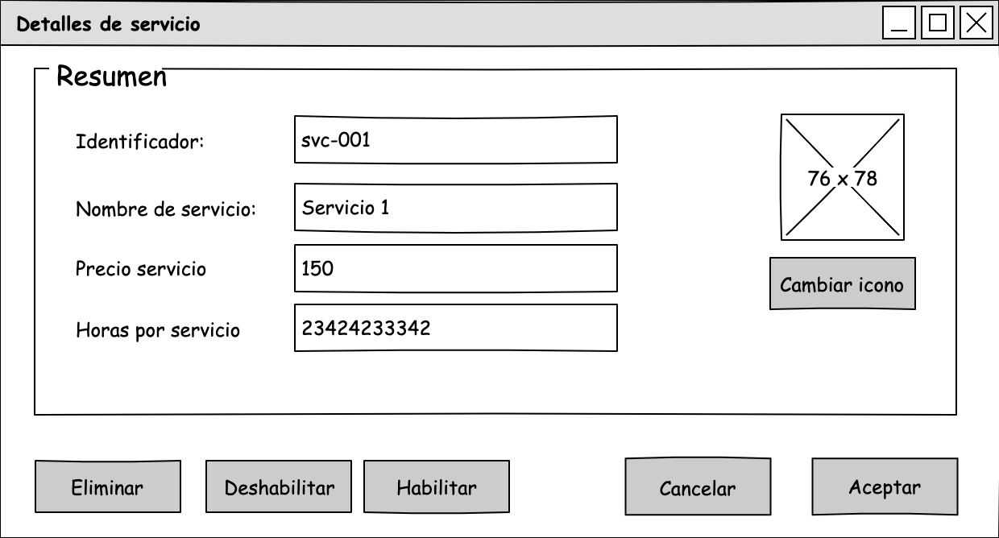

#### Client Module

| Use-case field       | Description                                                                                                                                                                                                                                                                                                                                                                                                                         |
| -------------------- | ----------------------------------------------------------------------------------------------------------------------------------------------------------------------------------------------------------------------------------------------------------------------------------------------------------------------------------------------------------------------------------------------------------------------------------- |
| Use case name        | CE-1 Register Client                                                                                                                                                                                                                                                                                                                                                                                                                |
| Actors               | Administrator                                                                                                                                                                                                                                                                                                                                                                                                                       |
| Use case overview    | The Administrator registers a new client to allow him to schedule their appointments                                                                                                                                                                                                                                                                                                                                                |
| Preconditions        |                                                                                                                                                                                                                                                                                                                                                                                                                                     |
| Postcondition        | POST-01: A CLIENT is successfully registered.                                                                                                                                                                                                                                                                                                                                                                                       |
| Trigger              | The Administrator presses the button "Registrar" in the "Client" window.                                                                                                                                                                                                                                                                                                                                                            |
| Use case description | NF-1: The System displays the "Registrar cliente" window. NF-2: The Administrator provides the information and presses the button "Registrar" (AF-1) NF-3: The System validates the information (AF-2), register a new CLIENT in the database and displays a successful message (EX-1, EX-2) NF-4: The use case ends here.                                                                                                 |
| Alternative Flows    | **AF-1: The Administrator cancels the operation** AF-1.1: The System close the window. AF-1.2: The use use case ends here. **AF-2 The data are invalid:** AF-2.1: The System notifies the Administrator has provided invalid data and prompts him to send valid data. AF-2.2: The use case flow returns to NF-2.                                                                                                     |
| Exception            | **EX-1: No internet connection** EX-1.1: The System displays an error message prompting the user to check their network connection and try again. EX-1.2: The use case ends here. **EX-2: Error to execute operation** EX-2.1: The System encounters an internal error (e.g., database failure, server timeout) and notifies the user of the issue, offering to retry the operation. EX-2.2: The use case ends here. |

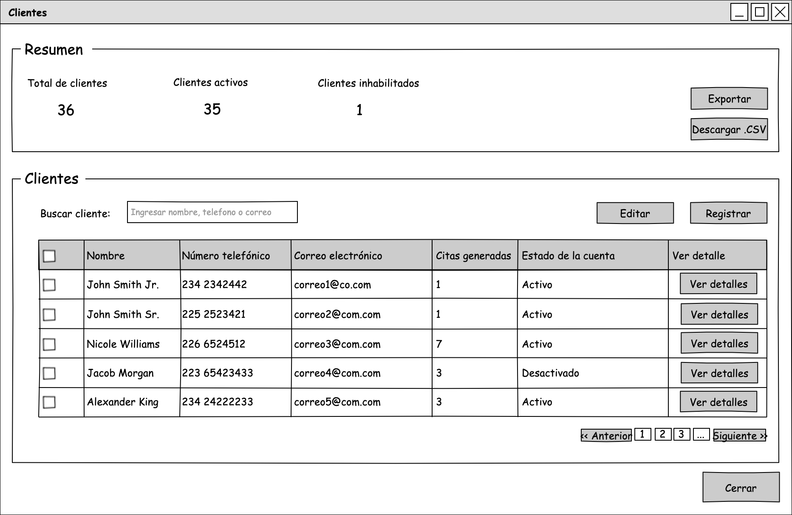

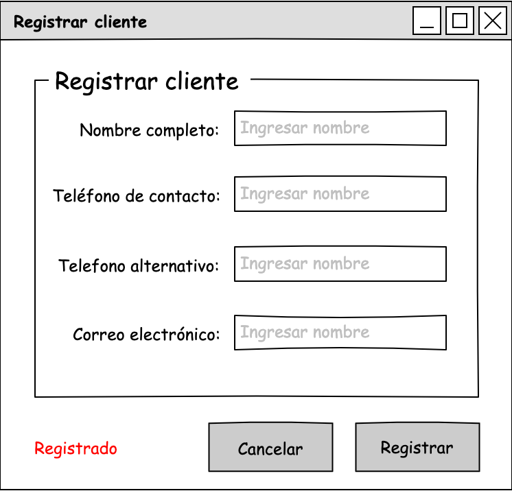

| Use-case field       | Description                                                                                                                                                                                                                                                                                                                                                                                                                                                                                                                               |
| -------------------- | ----------------------------------------------------------------------------------------------------------------------------------------------------------------------------------------------------------------------------------------------------------------------------------------------------------------------------------------------------------------------------------------------------------------------------------------------------------------------------------------------------------------------------------------- |
| Use case name        | CE-2 Disable Client                                                                                                                                                                                                                                                                                                                                                                                                                                                                                                                       |
| Actors               | Administrator                                                                                                                                                                                                                                                                                                                                                                                                                                                                                                                             |
| Use case overview    | The Administrator disable the client account to avoid to him to login to the system.                                                                                                                                                                                                                                                                                                                                                                                                                                                      |
| Preconditions        | PRE-01: The CLIENT must be registered. PRE-02: The CLIENT must have ENABLED state.                                                                                                                                                                                                                                                                                                                                                                                                                                                     |
| Postcondition        | POST-01: The status of CLIENT is changed to DISABLED                                                                                                                                                                                                                                                                                                                                                                                                                                                                                      |
| Trigger              | The Administrator presses the button "Editar cliente" in the "Clientes" window.                                                                                                                                                                                                                                                                                                                                                                                                                                                           |
| Use case description | NF-1: The System displays the "Editar cliente" window with information of the CLIENT. NF-2: The Administrator presses the button "Desactivar" (AF-1) NF-3: The System shows a confirmation window and requests the ADMINISTRATOR's password   NF-3: The Administrator enters the ADMINISTRATOR's password and presses the "Confirm" button. (AF-1) NF-4: The System validates the information (AF-2), checks the CLIENT status (AF-3) and updates the Client status to DISABLED (EX-1, EX-2) NF-5: The use case ends here. |
| Alternative Flows    | **AF-1: The Administrator cancels the operation** AF-1.1: The System close the window. AF-1.2: The use use case ends here. **AF-2 The data are invalid:** AF-2.1: The System notifies the Administrator has provided invalid data and prompts him to send valid data. AF-2.2: The use case flow returns to NF-2. **AF-3: The CLIENT is already disabled.** AF-3.1: The System notifies the Administrator that the ASSISTANT is already disabled. AF-3.2: The use case flow returns to NF-2.                    |
| Exception            | **EX-1: No internet connection** EX-1.1: The System displays an error message prompting the user to check their network connection and try again. EX-1.2: The use case ends here. **EX-2: Error to execute operation** EX-2.1: The System encounters an internal error (e.g., database failure, server timeout) and notifies the user of the issue, offering to retry the operation. EX-2.2: The use case ends here.                                                                                                       |

| Use-case field       | Description                                                                                                                                                                                                                                                                                                                                                                                                                                                                                                                            |
| -------------------- | -------------------------------------------------------------------------------------------------------------------------------------------------------------------------------------------------------------------------------------------------------------------------------------------------------------------------------------------------------------------------------------------------------------------------------------------------------------------------------------------------------------------------------------- |
| Use case name        | CE-3 Enable Client                                                                                                                                                                                                                                                                                                                                                                                                                                                                                                                     |
| Actors               | Administrator                                                                                                                                                                                                                                                                                                                                                                                                                                                                                                                          |
| Use case overview    | The Administrator enable the client account to allow Client to login to the system.                                                                                                                                                                                                                                                                                                                                                                                                                                                    |
| Preconditions        | PRE-01: The CLIENT must be registered. PRE-02: The CLIENT must have DISABLED state.                                                                                                                                                                                                                                                                                                                                                                                                                                                 |
| Postcondition        | POST-01: The status of CLIENT is changed to ENABLED                                                                                                                                                                                                                                                                                                                                                                                                                                                                                    |
| Trigger              | The Administrator presses the button "Editar cliente" in the "Clientes" window.                                                                                                                                                                                                                                                                                                                                                                                                                                                        |
| Use case description | NF-1: The System displays the "Editar cliente" window with information of the CLIENT. NF-2: The Administrator presses the button "Activar" (AF-1) NF-3: The System shows a confirmation window and requests the ADMINISTRATOR's password   NF-3: The Administrator enters the ADMINISTRATOR's password and presses the "Confirm" button. (AF-1) NF-4: The System validates the information (AF-2), checks the CLIENT status (AF-3) and updates the Client status to ENABLED (EX-1, EX-2). NF-5: The use case ends here. |
| Alternative Flows    | **AF-1: The Administrator cancels the operation** AF-1.1: The System close the window. AF-1.2: The use use case ends here. **AF-2 The data are invalid:** AF-2.1: The System notifies the Administrator has provided invalid data and prompts him to send valid data. AF-2.2: The use case flow returns to NF-2. **AF-3: The CLIENT is already enabled.** AF-3.1: The System notifies the Administrator that the ASSISTANT is already enabled. AF-3.2: The use case flow returns to NF-2.                   |
| Exception            | **EX-1: No internet connection** EX-1.1: The System displays an error message prompting the user to check their network connection and try again. EX-1.2: The use case ends here. **EX-2: Error to execute operation** EX-2.1: The System encounters an internal error (e.g., database failure, server timeout) and notifies the user of the issue, offering to retry the operation. EX-2.2: The use case ends here.                                                                                                    |

| Use-case field       | Description                                                                                                                                                                                                                                                                                                                                                                                                                         |
| -------------------- | ----------------------------------------------------------------------------------------------------------------------------------------------------------------------------------------------------------------------------------------------------------------------------------------------------------------------------------------------------------------------------------------------------------------------------------- |
| Use case name        | CE-4 Delete Client                                                                                                                                                                                                                                                                                                                                                                                                                  |
| Actors               | Administrator                                                                                                                                                                                                                                                                                                                                                                                                                       |
| Use case overview    | The administrator removes a client from the system.                                                                                                                                                                                                                                                                                                                                                                                 |
| Preconditions        | PRE-01: A CLIENT must be registered.                                                                                                                                                                                                                                                                                                                                                                                                |
| Postcondition        | POST-01: A CLIENT is successfully deleted.                                                                                                                                                                                                                                                                                                                                                                                          |
| Trigger              | The Administrator selects a CLIENT and presses the button "Editar" in the "Clientes" window.                                                                                                                                                                                                                                                                                                                                        |
| Use case description | NF-1: The System shows a confirmation window and requests the ADMINISTRATOR's password   NF-2: The Administrator enters the ADMINISTRATOR's password and presses the "Confirm" button. (AF-1) NF-3: The System removes the CLIENT from the database and displays a successful message and removes the CLIENT from the "Clientes" window (EX-1, EX-2). NF-4: The use case ends here.                                        |
| Alternative Flows    | **AF-1: The Administrator cancels the operation** AF-1.1: The System close the window. AF-1.2: The use use case ends here.                                                                                                                                                                                                                                                                                                    |
| Exception            | **EX-1: No internet connection** EX-1.1: The System displays an error message prompting the user to check their network connection and try again. EX-1.2: The use case ends here. **EX-2: Error to execute operation** EX-2.1: The System encounters an internal error (e.g., database failure, server timeout) and notifies the user of the issue, offering to retry the operation. EX-2.2: The use case ends here. |

| Use-case field       | Description                                                                                                                                                                                                                                                                                                                                                                                                                         |
| -------------------- | ----------------------------------------------------------------------------------------------------------------------------------------------------------------------------------------------------------------------------------------------------------------------------------------------------------------------------------------------------------------------------------------------------------------------------------- |
| Use case name        | CE-5 Edit Client                                                                                                                                                                                                                                                                                                                                                                                                                    |
| Actors               | Administrator                                                                                                                                                                                                                                                                                                                                                                                                                       |
| Use case overview    | The Administrator updates the client's information                                                                                                                                                                                                                                                                                                                                                                                  |
| Preconditions        | PRE-01: A CLIENT must be registered.                                                                                                                                                                                                                                                                                                                                                                                                |
| Postcondition        | POST-01: A CLIENT is successfully updated.                                                                                                                                                                                                                                                                                                                                                                                          |
| Trigger              | The Administrator presses the button "Editar cliente" in the "Clientes" window.                                                                                                                                                                                                                                                                                                                                                     |
| Use case description | NF-1: The System displays the "Editar cliente" window. NF-2: The Administrator provides the information and presses the button "Editar" (AF-1) NF-3: The System validates the information (AF-2), register a new CLIENT in the database and displays a successful message (EX-1, EX-2) NF-4: The use case ends here.                                                                                                       |
| Alternative Flows    | **AF-1: The Administrator cancels the operation** AF-1.1: The System close the window. AF-1.2: The use use case ends here. **AF-2 The data are invalid:** AF-2.1: The System notifies the Administrator has provided invalid data and prompts him to send valid data. AF-2.2: The use case flow returns to NF-2.                                                                                                     |
| Exception            | **EX-1: No internet connection** EX-1.1: The System displays an error message prompting the user to check their network connection and try again. EX-1.2: The use case ends here. **EX-2: Error to execute operation** EX-2.1: The System encounters an internal error (e.g., database failure, server timeout) and notifies the user of the issue, offering to retry the operation. EX-2.2: The use case ends here. |

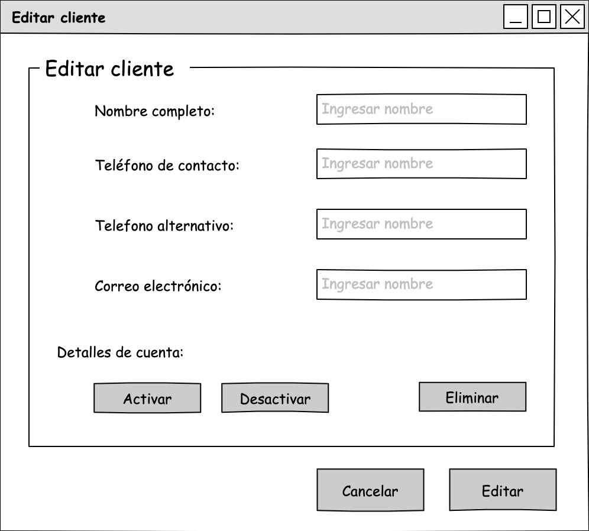

### Functional Requirements

- The system should allow selecting a time range and block that slot for at least 2 minutes before the appointment is canceled. The selected time range should have a maximum duration of 8 hours.
- The system should only allow scheduling a maximum of one appointment per user.
- The system must notify the administrator, client or assistant within 10-15 seconds when an appointment is created, finalized or canceled.
- The system must send automated reminders (via email or SMS) to users (clients, assistants, or administrators) about upcoming appointments at predefined intervals (30 minutes before the appointment).
- The system should keep a record of all past appointments and their statuses (completed or canceled) and allow users to view their appointment history.
- The system should allow clients to cancel appointments before the appointment is started.
- The system should automatically detect scheduling conflicts and prevent them (like race condition).
- The system must allow up to 10 minutes of overlap between appointments.

### Constraints

| ID    | Constraint                                                                                                                                                 |
| ----- | ---------------------------------------------------------------------------------------------------------------------------------------------------------- |
| CON-1 | Users must interact with the system through a web browser in different platforms (Windows, OSX, and Linux and different devices like computers or mobiles) |
| CON-2 | Code must be hosted on a proprietary Git-based platform like Github                                                                                        |
| CON-3 | Future support for mobile clients like IOS and Android                                                                                                     |
| CON-4 | Race condition problems must be avoided during high user traffic or parallel processing.                                                                   |

### Concerns

| ID    | Concern                                          |
| ----- | ------------------------------------------------ |
| CRN-1 | Establish an overall initial system architecture |
| CRN-2 | Avoid introducing technical debt                 |
| CRN-3 | Set up a continuous deployment infrastructure    |

### Quality Attributes

1. The system must be operational and accessible during working hours, including weekends (availability).
2. The system must support data encryption (especially for passwords and bank account information) to protect against unauthorized access (security).
3. The system must be capable of adding new features within a maximum of 2 months (modifiability).
4. The system should support multiple languages for a diverse user base, depending on the geographic region (internationalization, usability).
5. The system must support at least 500 users concurrently querying the prices of services and should be capable of handling up to 1,000 without decreasing average latency by more than 20%. (Performance)
6. The system must allow integration with external system, such as messaging and email services. (Interoperability)
7. The system must support integration testing independently of external systems (Testability)
8. The system must validate user credentials against an Identity User Service, and once logged in, the user can only access the actions they are authorized to perform. (Security)
9. The system must be integrad with a continuous deployment pipeline to automatically deploy new changes to production after successful testing. (Reliability)

Quality Attribute Scenarios

| ID  | Quality Attribute | Scenario                                                                                                                                                                                                                       | Associated Use Case          |
| --- | ----------------- | ------------------------------------------------------------------------------------------------------------------------------------------------------------------------------------------------------------------------------ | ---------------------------- |
| 1   | Availability      | The system must be operational and accessible during working hours, including weekends, with an uptime of 99.5% or higher.                                                                                                     | All                          |
| 2   | Security          | The system must use strong data encryption protocols for sensitive information, such as passwords and bank account details, to protect against unauthorized access and breaches.                                               | ---                          |
| 3   | Modifiability     | The system must support the addition of new features within a maximum of 2 months, including development, testing and deployment phases.                                                                                       | All                          |
| 4   | Usability         | The system should support multiple languages to accommodate a diverse user base, with localization depending on the geographic region of users.                                                                                | All                          |
| 5   | Performance       | The system must support at least 500 users concurrently querying the prices of services and should be capable of handling up to 1,000 without decreasing average latency by more than 20%.                                     | ---                          |
| 6   | Interoperability  | The system must support integration with external system, such as messaging and email services ensuring communication is reliable and occurs within 10 seconds of triggered events.                                            | All                          |
| 7   | Testability       | The system must support integration testing independently of external systems by using stubs                                                                                                                                   | All                          |
| 8   | Security          | The system must validate user credentials against an Identity User Service, ensuring that once logged in, users can only access the actions and data they are authorized to use or view                                        | All                          |
| 9   | Reliability       | The system must ensure automated, seamless deployment of new features and bug fixes to production, with a maximum of downtime of 5 minutes per deployment and no rollback incidents in 95% of cases                            | All                          |
| 10  | Reliability       | The system must ensure that race conditions are avoided during concurrent transactions, ensuring that multiple users or processes can access and modify shared data without leading to inconsistent states or data corruption. | CA-1, CA-2, CB-1, CB-2, CB-3 |

## Attribute-Driven Design (ADD)

The objective of starting an Attribute-Driven Design process is to establish a solid foundation that supports the system's quality attribute requirements, accommodates future changes or feature additions, and acts as a guide for development teams, ensuring a shared understanding of the system's structure and its components.

### ADD Step 1. Review Inputs

**Task**: Identify which requirement will be considered as architectural drivers.

| Scenario ID             | Importance to the Customer | Difficulty of Implementation |
| ----------------------- | -------------------------- | ---------------------------- |
| QA-1 Availability       | High                       | High                         |
| QA-9, QA-10 Reliability | High                       | High                         |
| QA-6 Interoperability   | High                       | Medium                       |
| QA-3 Modifiability      | High                       | Medium                       |
| QA-2, QA-8 Security     | High                       | Medium                       |
| QA-5 Performance        | Medium                     | High                         |
| QA-7 Testability        | Medium                     | Medium                       |
| QA-4 Usability          | Low                        | Medium                       |

| Category                        | Details                                                                                                                                                                                                                                                                                                                                                                                                                                                                                                                                                                                                |
| ------------------------------- | ------------------------------------------------------------------------------------------------------------------------------------------------------------------------------------------------------------------------------------------------------------------------------------------------------------------------------------------------------------------------------------------------------------------------------------------------------------------------------------------------------------------------------------------------------------------------------------------------------ |
| Design purpose                  | The purpose of the design activity is to make initial decisions to support the construction of the system from scratch.                                                                                                                                                                                                                                                                                                                                                                                                                                                                                |
| Primary functional requirements | CE-1 Register client — It establishes a basis for other use cases CC-1 Register assistant — It establishes a basis for other use cases CD-1 Register service — It establishes a basis for other use cases CB-1 Assign availability time slot — It establishes a basis for other use cases  All the modules (clients, assistant, services, and appointment availability) are necessary for appointment schedule module.  CA-1 Schedule appointment (Client-self) — It supports the core business CA-5 Schedule appointment (Staff-assisted) — It supports the core business  |
|                                 | From this list, QA-1, QA-9, QA-6, QA-3 are selected as primary drivers.                                                                                                                                                                                                                                                                                                                                                                                                                                                                                                                                |
| Constraints                     | All of the previously constraints are included as drivers                                                                                                                                                                                                                                                                                                                                                                                                                                                                                                                                              |
| Architectural concerns          | All of the previously concerns associated with the system are included as drivers                                                                                                                                                                                                                                                                                                                                                                                                                                                                                                                      |

### Iteration 1: Establishing an Overall System Structure
#### Step 2: Establishing Iteration Goal by Selecting Drivers

The iteration goal is to establish an initial overall structure for the system considering the drivers that influence the general structure of the system:
* QA-9, QA-10 Reliability
* QA-1 Availability
* QA-2, QA-8 Security
* CON-1 Users must interact with the system through a web browser in different platforms (Windows, OSX, and Linux and different devices like computers or mobiles)
* CRN-2 Avoid introducing technical debt
* CRN-1 Establishing an overall system architecture

#### Step 3: Choose Elements of the System to Refine

The iteration goal is to achieve the architectural concern CRN-1 and refine the entire Appointment Scheduling System. In this case, refinement is performed through decomposition.

#### Step 4: Choose One or More Design Concepts That Satisfy the Selected Drivers

In Greenfield system within mature domains, the design concepts that must be selected include reference architecture and deployment patterns and externally developed components. The table below represents design concepts along with their candidates:

| Design concepts                 | Candidates                                                                                                                  |
| ------------------------------- | --------------------------------------------------------------------------------------------------------------------------- |
| Reference architectures         | -Mobile applications -Web Applications -Service Application -Rich Internet Application -Rich Client Application |
| Deployment Patterns             | -4 tier -3 tier -2 tier                                                                                               |
| Externally Developed Components | ---                                                                                                                         |

| Design Decision                 | Rationale                                                                                                                                                                                                                                                                                                                                                                                                                                                                                                                                             | Reference                      |
| ------------------------------- | ----------------------------------------------------------------------------------------------------------------------------------------------------------------------------------------------------------------------------------------------------------------------------------------------------------------------------------------------------------------------------------------------------------------------------------------------------------------------------------------------------------------------------------------------------- | ------------------------------ |
| Mobile Application              | A mobile application allows **clients and assistants** to interact with the system on the go, enhancing **availability** by ensuring access anywhere and anytime, even when they are away from a desktop.                                                                                                                                                                                                                                                                                                                                       | CON-1, CON-3,  QA-1         |
| Rich Internet Application (RIA) | Provides a more interactive and responsive experience than traditional web apps, with reduced dependency on the server. RIAs can be easily updated because the logic and interface are managed centrally on the server, but the rich client-side interactivity allows for a smoother experience. Modifications on the client side can be done independently of the server-side changes, improving **modifiability**. Once loaded, an RIA can work with minimal server communication, improving the performance and responsiveness of the application. | CON-2, QA-6, QA-3              |
| Service Application             | A service application (API Layer) encapsulates core functionality and ensures **reliability** through modular design. This separation reduces the chance of failure in one part affecting the whole system. It supports **scalability** and **reuse** of services for multiple clients like mobile, web, and CLI. It does not provide a user interface but rather expose services that are consumed by other applications.                                                                                                                            | CON-1, CON-3, QA-9             |
| 3 tier                          | Provides a simple, well-established separation of concerns between presentation, business logic, and data layers, which enhances **reliability**, **scalability**, **maintainability**, and cost-effectiveness without introducing unnecessary complexity.                                                                                                                                                                                                                                                                                            | CON-1, CON-3, QA-9, QA-3, QA-6 |

**Discarded Alternatives**

| Design Decision | Rationale                                                                                                                                                                                                                                                                                                                                                                                                             |
| --------------- | --------------------------------------------------------------------------------------------------------------------------------------------------------------------------------------------------------------------------------------------------------------------------------------------------------------------------------------------------------------------------------------------------------------------- |
| Web Application | Typically, web applications are less interactive and rely heavily on page reloads for updates, which can make the user experience feel slower and less responsive. Standard web apps can suffer from performance issues, particularly when dealing with high-frequency updates or large amounts of data. Each user interaction may require a round-trip to the server, leading to latency and slower user experience. |
| 4 tier          | Introduces an additional layer that increases operational complexity and overhead, suitable for complex systems with advanced routing, traffic management, or microservices needs.                                                                                                                                                                                                                                    |

The following figures represent the reference architecture and deployment pattern that I have used as the foundation for gathering design concepts and making design decisions

**3-tier deployment pattern**

**Rich Internet Application (RIA)**

**Service Application** 

**Mobile Client Application**

#### Step 5: Instantiate Architectural Elements, Allocate Responsibilities, and Define Interfaces

The instantiation design decisions considered and made are summarized in the following table:

| Design Decision and Location                                                         | Rationale                                                                                                                                                                                                                                                                                                                                                                                                                                                                                                                                                                                                                                                                                                                                                                                                                                                                                                                                                                                                                                                                    |
| ------------------------------------------------------------------------------------ | ---------------------------------------------------------------------------------------------------------------------------------------------------------------------------------------------------------------------------------------------------------------------------------------------------------------------------------------------------------------------------------------------------------------------------------------------------------------------------------------------------------------------------------------------------------------------------------------------------------------------------------------------------------------------------------------------------------------------------------------------------------------------------------------------------------------------------------------------------------------------------------------------------------------------------------------------------------------------------------------------------------------------------------------------------------------------------- |
| Use Angular to implement the front-end component for Web Browsers                    | Angular is selected because the team has experience with this framework and because it supports the development of responsive front-ends. This is necessary to support **CON**-1  Discarded alternatives are: -React: While React provides a flexible and fast rendering engine, it does not provide as many built-in features as Angular, which would require the team to integrate additional tools for routing, state management, and form handling, potentially complicating maintainability and increasing development time -Vue.js: Although Vue.js is easier to integrate and offers simplicity, it is not as widely adopted in enterprise-scale projects as Angular. This could pose challenges in terms of long-term support, available resources, and scalability for the project. It may also lead to potential issues with cohesion and maintainability in larger teams or projects.                                                                                                                                                                 |
| Use Swift for the Mobile Application (IOS)                                           | Swift is selected for iOS app development due to its strong performance, modern syntax, and security features. It provides a native and highly optimized experience for iOS users. It is necessary to support **CON-3**                                                                                                                                                                                                                                                                                                                                                                                                                                                                                                                                                                                                                                                                                                                                                                                                                                                      |
| Use Android (Java/Kotlin) for Mobile Application Development                         | Android is selected due to its wide user base and flexibility in supporting different device types. With Java/Kotlin, the team can leverage a large ecosystem, ensuring scalability and maintainability. This is necessary to support **CON-3**                                                                                                                                                                                                                                                                                                                                                                                                                                                                                                                                                                                                                                                                                                                                                                                                                              |
| Host the code on a proprietary Git-based platform (GitHub)                           | GitHub is selected due to its industry-standard status, support for Git workflows, integration with CI/CD pipelines, and its broad ecosystem of tools that facilitate collaboration, version control, and code reviews. It supports **CON-2** by providing **interoperability** with development tools and services.  Discarded alternatives: GitLab (while it offers similar features, GitHub has a larger user base and integrations with other platforms).                                                                                                                                                                                                                                                                                                                                                                                                                                                                                                                                                                                                          |
| Implement Concurrency Control Mechanisms to Avoid Race Conditions                    | To ensure **reliability**, the system will implement mechanisms like **optimistic concurrency control**, **pessimistic locking**, or **transactional consistency** to prevent race conditions during concurrent data modifications. These mechanisms will ensure that multiple users or processes can access and modify shared data safely, without causing inconsistent or corrupted states. It is necessary to support **QA-10** and **CON-4**    Discarded alternatives: Not using any concurrency control (which would lead to unpredictable behavior and data corruption in high-load scenarios).                                                                                                                                                                                                                                                                                                                                                                                                                                                              |
| Use C# for Application Server                                                        | C# is selected for the application server because it is well-suited for building **scalable, high-performance web applications**. It has a strong ecosystem with **ASP.NET Core**, which offers robust support for building REST APIs and can handle high numbers of concurrent connections. **C#** supports **asynchronous programming** for high scalability and **reliability** (QA-10) by enabling the application to handle multiple requests without blocking threads.   Additionally, the **.NET** ecosystem provides excellent tooling for continuous integration and testing, improving **modifiability** (QA-3).                                                                                                                                                                                                                                                                                                                                                                                                                                                |
| Use a relational database                                                            | A relational database is selected due to its ability to enforce **data consistency** and its **maturity** in handling complex queries. Relational databases (RDBMS) ensure **data integrity**, and they are well-suited for structured data where relationships between tables are critical. They also offer **transactional support** to handle large amounts of data reliably. The database choice supports **QA-9** (reliability) by ensuring that the application maintains data consistency even in the face of failures.      Discarded alternatives:   - **NoSQL databases**: While NoSQL databases provide flexibility, they lack the strict consistency guarantees and transactional support required by the system, which could lead to data inconsistency in critical business processes.                                                                                                                                                                                                                                                                |
| Use Docker containers for deployment                                                 | Because the application has to be moved across environments (QA-7), deploying the application as a set of container images is preferred.  Virtual Machines are discarded because they are considerably larger than container images and requires more resources  than containers.                                                                                                                                                                                                                                                                                                                                                                                                                                                                                                                                                                                                                                                                                                                                                                                      |
| Define and expose REST APIs to the front-end and document them using Swagger/OpenAPI | REST APIs are chosen to facilitate communication between the front-end and the back-end. These APIs provide a standardized way for the front-end (Angular, Swift, or Android clients) to interact with the business logic and data layers. The use of **Swagger/OpenAPI** ensures that these APIs are well-documented and easily understandable by both developers and automated tools.  The documentation provides clarity and reduces ambiguity during development, contributing to better **modifiability** (QA-3) and **interoperability** (QA-7). Additionally, it helps improve **testability** (QA-7) by enabling automated API tests.  **Discarded alternatives:** SOAP: While SOAP provides a more rigid protocol for communication, it is less flexible and has more overhead than RESTful APIs. GraphQL: While GraphQL offers fine-grained data fetching, it can lead to more complex queries and requires more effort to implement and maintain. This would increase development time and complexity, which is not necessary for the current system. |
| Use TLS (HTTPs) to encrypt data in transit                                           | TLS (Transport Layer Security) is selected to ensure the confidentiality and integrity of data exchanged between the front-end and back-end, as well as any communication with external systems. By encrypting data in transit, TLS prevents man-in-the-middle (MITM) attacks and eavesdropping on sensitive information, such as user credentials or payment details. This choice supports **Security** (QA-2) and ensures compliance with industry standards for data protection.                                                                                                                                                                                                                                                                                                                                                                                                                                                                                                                                                                                          |
| Encrypt confidential data in database with symmetric encryption                      | Confidential data, such as user passwords, financial records, and other personally identifiable information, is encrypted within the database to protect it in the event of a data breach. Using encryption ensures that even if unauthorized access occurs, sensitive data remains unreadable. This supports **Security** (QA-2).                                                                                                                                                                                                                                                                                                                                                                                                                                                                                                                                                                                                                                                                                                                                           |

#### Step 6: Sketch Views and Record Design Decisions

**Module view**

| Element                  | Responsibility                                                                                                                                                                                                            |
| ------------------------ | ------------------------------------------------------------------------------------------------------------------------------------------------------------------------------------------------------------------------- |
| User Workstation         |                                                                                                                                                                                                                           |
| Presentation             | This layer contains modules that control user interaction and use case control flow.                                                                                                                                      |
| Business Logic           | This layer contains modules that perform business logic operations that can be executed locally on the client side.                                                                                                       |
| Data                     | This layer contains modules that are responsible for communication                                                                                                                                                        |
| Cross-Cutting            | This layer includes modules with functionality that goes across different layers                                                                                                                                          |
| UI Components            | These modules render the user interface and receive user inputs                                                                                                                                                           |
| UI Process Components    | These modules are responsible for control flow of all the system use cases (including navigation between screens)                                                                                                         |
| Business Components      | These modules either implement business operations that can be performed locally or expose business functionality from the server side                                                                                    |
| Business Entities        | These entities make up the domain model. They may be less detailed than those on the server side.                                                                                                                         |
| Communication Components | These modules consume the services provided by the application running on the server side.                                                                                                                                |
| Application Server       |                                                                                                                                                                                                                           |
| Services                 | This layer contains modules that expose services that are consumed by the clients                                                                                                                                         |
| Business Logic           | This layer contains modules that perform business logic operations that require processing on the server side.                                                                                                            |
| Data                     | This layer contains modules that are responsible for data persistence and communication with the database server and external system like email and messaging communication                                               |
| Service Interface        | These module expose services that are consumed by the clients                                                                                                                                                             |
| Business Components      | These modules implement business operations                                                                                                                                                                               |
| Business Entities        | These entities make up the domain model                                                                                                                                                                                   |
| DB Access Components     | The module is responsible for persistence of business entities (objects) into the relational database. It performs object-oriented to relational mapping and shields the rest of the application from persistence details |

Allocation view

The responsibilities of the elements are summarized in the following table:

| Element            | Responsibility                                                                       |
| ------------------ | ------------------------------------------------------------------------------------ |
| User Workstation   | The user's Mobile or Computer, which hosts the client side logic of the application  |
| Application Server | The server that hosts serevr side logic of the application an also servers web pages |
| Database Server    | The server that hosts the legacy database.                                           |

Also, information about relationships between some elements in the diagram that is worth recording is summarized in the following table:

| Relationship                                    | Description                                                                                            |
| ----------------------------------------------- | ------------------------------------------------------------------------------------------------------ |
| Between Application Server and Database Server  | Communication with the database will be done using any protocol in the stack of tcp/ip                 |
| Between User Workstation and Application Server | Communication with the Application Server will be done using http(s) protocol to secure communication. |
#### Step 7: Perform Analysis of Current Design and Review Iteration Goal and Achievement of Design Purpose

| Not Addressed | Partially Addressed                                                       | Addressed | Design Decisiones Made During Iteration                                                                                                                                                                                                              |
| ------------- | ------------------------------------------------------------------------- | --------- | ---------------------------------------------------------------------------------------------------------------------------------------------------------------------------------------------------------------------------------------------------- |
|               | Client, Schedule, Appointment Availability, Service and Assistant Modules |           | Selected reference architecture establishes the modules that will support this functionality.                                                                                                                                                        |
|               |                                                                           | CON-1     | The framework Angular will run on the client web browser.                                                                                                                                                                                            |
|               |                                                                           | CON-2     | The project will be hosted in a Git-based platform (Github).                                                                                                                                                                                         |
|               |                                                                           | CON-3     | The application will run in native in IOS and Android using a layered architecture.                                                                                                                                                                  |
|               | CON-4                                                                     |           | Initial measures were considered, but further measures are needed.                                                                                                                                                                                   |
|               |                                                                           | CRN-1     | Establishing an overall initial system architecture was the goal of this iteration.                                                                                                                                                                  |
|               | CRN-2                                                                     |           | Technologies that have been considered up to this point take into account the knowledge of the developers.                                                                                                                                           |
| CRN-3         |                                                                           |           | No relevant decisions were made.                                                                                                                                                                                                                     |
|               | QA-1                                                                   |           |                                                                                                                                                                                                                                                      |
|               |                                                                           | QA-2      | The measures selected align with industry standards and safeguard sensitive information                                                                                                                                                              |
|               | QA-3                                                                      |           | The client-server style separates concerns, allowing independent development of client and server components. REST APIs and layered architecture further isolate system parts, making updates and changes easier. But further iterations can be done |
| QA-4          |                                                                           |           | No relevant decisions were made.                                                                                                                                                                                                                     |
| QA-5          |                                                                           |           | No relevant decisions were made.                                                                                                                                                                                                                     |
|               | QA-6                                                                      |           | Initial overall system architecture were considered, but further measures are needed.                                                                                                                                                                |
|               | QA-7                                                                      |           | A measure has been selected to contribute to achieving testability by ensuring consistent and reproducible test environments. However, further measures are needed.                                                                                  |
|               |                                                                           | QA-8      | The measures selected align with industry standards and safeguard sensitive information                                                                                                                                                              |
|               | QA-9                                                                      |           | A measure has been selected to contribute. However, further measures are needed.                                                                                                                                                                     |
|               | QA-10                                                                     |           | Techniques were identified, but further details are needed.                                                                                                                                                                                          |
### Iteration 2: Identifying Structures to Support Primary Functionality

#### Step 2. Establish Iteration Goal by Selecting Drivers

In this iteration, the design focuses on the back-end of the application. The goal is to identify structures that support primary functionality. The first use cases considered are:
* CE-1 Register client
* CB-1 Assign availability time slot
* CC-1 Register assistant
* CD-1 Register service
Since these use case and its modules are CRUD-based and share related behavior, I chose to apply domain decomposition to create components and accommodate the functionality within the architecture. This approach follows the reference method describe by John Chessman in "A Simple Process for Specifying Component-Based Software".

#### Step 3. Choose Elements of the System to Refine

In this iteration, the elements to be refined are the modules located across the different layers defined by the two reference architectures established in the previous iteration. The functionality needed to support the system’s use cases will require the collaboration of components located in these different layers, ensuring they work together to provide the necessary services.
#### Step 4. Choose Design Concepts That Satisfy the Selected Drivers

The following table summarizes the design decisions.

| Design Decision and Location                             | Rational and Assumptions                                                                                                                                                                                                                                                                                                                                                                                                                                                                                                                                                                        |
| -------------------------------------------------------- | ----------------------------------------------------------------------------------------------------------------------------------------------------------------------------------------------------------------------------------------------------------------------------------------------------------------------------------------------------------------------------------------------------------------------------------------------------------------------------------------------------------------------------------------------------------------------------------------------- |
| Select Domain-Decomposition for Component-Based Software | Domain decomposition is selected as the primary approach for defining the system’s components because the core functionality is centered around CRUD operations that share related business behavior. By organizing components based on business domains, each module can encapsulate related logic, making the system more maintainable and scalable. This also enables better isolation of concerns, allowing each domain to evolve independently while still maintaining clear boundaries between the components. Domain decomposition provides a natural mapping to the system’s use cases. |
| Select Repository Pattern                                |                                                                                                                                                                                                                                                                                                                                                                                                                                                                                                                                                                                                 |
| Select Observer Pattern                                  |                                                                                                                                                                                                                                                                                                                                                                                                                                                                                                                                                                                                 |

#### Step 5. Instantiate Architectural Elements, Allocate Responsibilities and Define Interfaces

The instantiation design decisions considered and made are summarized in the following table:

| Design Decision and Location                                   | Rational and Assumptions |
| -------------------------------------------------------------- | ------------------------ |
| Locate System Interfaces into Services Interfaces              |                          |
| Locaate Business Interfaces into Business Interfaces           |                          |
| Create an Application Facade to coordinate business components |                          |

#### Step 6. Sketch Views and Record Design Decisions

##### Component Architecture

##### Interface Responsibility Diagram

| Business Interface | Diagram                                               |
| ------------------ | ----------------------------------------------------- |
| ISchedulerMgt      |  |
| IClientMgt         |     |
| IServiceMgt        |    |
| IAssistantMgt      |  |

| System Interfaces and Collaboration Diagrams | Diagram                                                                 |
| -------------------------------------------- | ----------------------------------------------------------------------- |
| IScheduleAppointmentClientSelf               |     |
| scheduleAppointmentAsClient()             | .png)         |
| IScheduleAppointmentStaffAssisted            |  |
| getAppointmentDetails()                      | .png)               |
| confirmAppointment()                         | .png)                  |
| getAppointments()                            | .png)                     |
| getAvailableServices()                       | .png)                |
| scheduleAppointmentAsStaff()                 | .png)          |
| IAssignAvailabilityTimeSlot                  |        |
| registerAvailabilityTimeSlot()               | .png)        |
| IEditAppointment                             |                   |
| editAppointment()                            | .png)                     |
| IFinalizeAppointment                         |               |
| finalizeAppointment()                        | .png)              |
| ICancelAppointmentClientSelf                 |       |
| cancelAppointmentClientSelf()                | .png)         |
| ICancelAppointmentStaffAssisted              |     |
| cancelAppointmentStaffAssisted()             | .png)      |
| IAssignAvailabilityTimeSlot                  |        |
| registerAvailabilityTimeSlot()               | .png)        |
| IDeleteAvailabilityTimeSlot                  |        |
| deleteAvailabilityTimeSlot()                 |             |
| IEditAvailabilityTimeSlot                    |          |
| editAvailabilityTimeSlot()                   | .png)            |
| IEnableService                               |                     |
| enableService()                              | .png)                       |
| IDisableService                              |                    |
| disableService()                             | .png)                      |
| IEditService                                 |                       |
| editService()                                | .png)                         |
| IDeleteService                               |                     |
| deleteService()                              | .png)                       |
| IRegisterService                             |                   |
| registerService()                            | .png)                     |
| IRegisterAssistant                           |                 |
| registerAssistant()                          | .png)                   |
| IEditAssistant                               |                     |
| editAssistant()                              | .png)                       |
| IDisableAssistant                            |                  |
| dissableAssistant()                          | .png)                    |
| IEnableAssistant                             |                   |
| enableAssistant()                            | .png)                     |
| IDisableClient                               |                     |
| disableClient()                              | .png)                       |
| IEnableClient                                |                      |
| enableClient()                               | .png)                        |
| IRegisterClient                              |                    |
| registerClient()                             | .png)                      |

Initial elements allocation is in process...

* Consider implementing an Idempotent Receiver and Replay Protection to ensure that duplicate messages are not processed.
* The Observer Pattern is being applied. Some diagrams need to be updated.
* "Apply communication between components using a notification system (app, email or messaging)."

#### Step 7. Perform Analysis of the Current Design and Review the Iteration Goal and Achievement of Design Purpose

